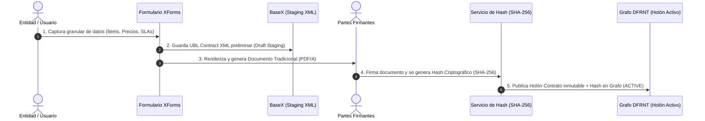

# Análisis UBL 2.1: Estrategia Shift Left hacia el Contrato, Holones y la Teoría de Shyam Sunder

## Resumen Ejecutivo

En la evolución de la arquitectura de software, contabilidad digital y auditoría continua (**Accounting & Audit by Design / Open-EDI ISO 15944-4**), la estrategia de **"Shift Left hacia el Contrato"** traslada la lógica de validación, reglas de negocio, listas de precios, SLAs y restricciones operativas desde la fase reactiva (facturación/auditoría post-facto) hacia la **fase de compromiso (el Contrato o la Adjudicación de Licitación)**.

Basándose en la **Teoría de la Contabilidad y Control de Shyam Sunder (1997)** y la **Arquitectura Holónica (Koestler)**, el contrato deja de ser un documento pasivo en PDF para convertirse en un **Holón de Gobierno en el Grafo de Conocimiento (DFRNT / JSON-LD)**, que compila y ejecuta las reglas invariantes sobre todo el flujo transaccional.

---

## 1. Fundamentación Teórica: El Contrato como Holón de Control

### A. Teoría de Shyam Sunder (Nexus of Contracts & Control)
Para Shyam Sunder (*Theory of Accounting and Control*, 1997), la empresa es conceptualizada como un **nexo o red de contratos (*Nexus of Contracts*)** entre múltiples agentes económicos (proveedores, compradores, empleados, accionistas, estado).

En este marco, la contabilidad y los sistemas de información actúan como el **mecanismo de medición y control** para supervisar el cumplimiento contractual, definiendo:
1. Las **insumos/aportes esperados** de cada agente.
2. Los **derechos de propiedad y retribución económica** (precios y pagos).
3. Los **mecanismos de observabilidad y control** para resolver la asimetría de información y el riesgo moral.

### B. El Contrato como Holón (Holarchic Graph Entity)
Un **Holón** es una estructura dual (Arthur Koestler):
* **Como un TODO (Autonomía interna)**: Encapsula sus propias reglas de negocio, invariantes (límites de volumen, vigencias, tablas de precios), cláusulas operativas (`cac:ContractualTerms`) y su máquina de estados (`Draft` $\rightarrow$ `Active` $\rightarrow$ `Fulfilled` $\rightarrow$ `Closed`).
* **Como una PARTE (Integración en la Holarquía del Grafo)**: Se conecta como un nodo central con otros Holones del Grafo: Holones de Agentes (`cac:AccountingSupplierParty`, `cac:AccountingCustomerParty`), Holones de Recursos (`cac:Item`) y Holones de Eventos (`Order`, `DespatchAdvice`, `Invoice`).

---

## 2. Mapeo Ontológico Estándar (UBL 2.1 + REA / ISO 15944-4 + DFRNT)

Para estandarizar la captura del **Holón Contrato** en un Grafo de Conocimiento, alineamos las siguientes capas:

| Capa Jurídica / Negocio (UBL 2.1) | Capa Ontológica Económica (ISO 15944-4 / REA) | Capa de Grafo (DFRNT / JSON-LD) | Función en la Teoría de Sunder |
| :--- | :--- | :--- | :--- |
| `cac:Contract` | **Commitment / Reciprocal Agreement** | `@type: "ContractHolon"` | Definición formal de derechos y obligaciones. |
| `cac:AccountingSupplierParty` | **Economic Agent (Provider)** | `has_supplier -> Agent` | Identificación inmutable del proveedor. |
| `cac:AccountingCustomerParty` | **Economic Agent (Buyer)** | `has_buyer -> Agent` | Identificación del comprador / entidad de control. |
| `cac:PriceList` / `Price` | **Economic Resource Value** | `has_price_schedule -> PriceSchedule` | Regla invariante de retribución económica. |
| `cac:ContractualTerms` | **Business Rules & Control Terms** | `has_terms -> ClauseRule` | Criterios de tolerancia, penalizaciones y SLAs. |
| `cac:ValidityPeriod` | **Temporal Boundary** | `validity_period -> Period` | Ventana temporal de observabilidad y vigencia. |
| `cac:ContractDocumentReference` | **Traceability Linkage** | `governed_by -> ContractHolon` | Relación de control sobre eventos aguas abajo (`Invoice`, `Order`). |

---

## 2.1 Mecanismos de Anclaje del Contrato en UBL 2.1 (XML & Grafo)

El estándar **OASIS UBL 2.1** provee dos mecanismos principales para anclar la dimensión contractual a través de toda la cadena transaccional:

### A. Documentos Raíz de Contratación (Origen / Nacimiento del Holón)
UBL 2.1 define documentos XML nativos para formalizar la relación contractual antes de cualquier pedido o factura:
* **`ContractAwardNotice` (Notificación de Adjudicación)**: Formaliza la adjudicación del contrato e incluye el nodo `<cac:Contract>`.
* **`ContractNotice` (Licitación)**: Define las bases, pliegos (`cac:TenderRequirement`) y términos operativos.

### B. Nodos Agregados de Anclaje (`cac:Contract` y `cac:ContractDocumentReference`)
Para conectar transacciones operativas (`Order`, `DespatchAdvice`, `Invoice`) con el contrato inmutable, UBL 2.1 utiliza dos estructuras clave:

1. **`cac:Contract`** (Estructura completa del contrato dentro del documento raíz):
   Contiene el identificador (`cbc:ID`), el tipo (`cbc:ContractTypeCode`), la vigencia (`cac:ValidityPeriod`) y las condiciones contractuales (`cac:ContractualTerms`).

2. **`cac:ContractDocumentReference`** (Puntero de trazabilidad en documentos transaccionales):
   Presente en el encabezado de `Invoice`, `Order`, `DespatchAdvice` y `ReceiptAdvice`. Permite que la transacción operativa declare explícitamente bajo qué contrato existe.

#### Ejemplo de Anclaje en XML UBL 2.1 (Fragmento de `Invoice.xml` / `Order.xml`)
```xml
<Invoice xmlns="urn:oasis:names:specification:ubl:schema:xsd:Invoice-2"
         xmlns:cac="urn:oasis:names:specification:ubl:schema:xsd:CommonAggregateComponents-2"
         xmlns:cbc="urn:oasis:names:specification:ubl:schema:xsd:CommonBasicComponents-2">
    <cbc:ID>INV-2026-0891</cbc:ID>
    
    <!-- ANCLAJE EXPLÍCITO AL CONTRATO MARCO EN UBL 2.1 -->
    <cac:ContractDocumentReference>
        <cbc:ID>CTR-2026-SUPPLIER-004</cbc:ID>
        <cbc:DocumentTypeCode>FRAMEWORK_AGREEMENT</cbc:DocumentTypeCode>
        <cbc:DocumentType>Contrato Marco de Suministro Logístico 2026</cbc:DocumentType>
        <cac:ValidityPeriod>
            <cbc:StartDate>2026-01-01</cbc:StartDate>
            <cbc:EndDate>2026-12-31</cbc:EndDate>
        </cac:ValidityPeriod>
    </cac:ContractDocumentReference>
    
    <!-- Resto del documento transaccional... -->
</Invoice>
```

#### Mapeo a Grafo de Conocimiento (DFRNT / JSON-LD)
Al ingerir el XML en la arquitectura de Grafo, el nodo `cac:ContractDocumentReference` se resuelve como una **arista dirigida de gobierno (`governed_by`)**:

```json
{
  "@id": "urn:dfrnt:invoice:INV-2026-0891",
  "@type": ["ubl:Invoice", "TransactionEvent"],
  "cbc:ID": "INV-2026-0891",
  
  "governed_by": {
    "@id": "urn:dfrnt:contract:CTR-2026-SUPPLIER-004"
  }
}
```
Esto habilita al motor de validación para realizar la traversa inmediata:
`Invoice` $\xrightarrow{\text{governed\_by}}$ `ContractHolon` $\rightarrow$ `Check PriceInvariants & SLAs`.


---

## 2.2 Ciclo de Vida de Creación y Firma del Contrato (XForms + Staging BaseX + Hash + Grafo DFRNT)

Para conectar el mundo documental/jurídico tradicional con el Grafo de Conocimiento inmutable, el flujo de creación del contrato sigue un ciclo de vida formalizado de **5 etapas**:



### Detalle del Flujo de Procesamiento:

1. **Captura Granular con XForms**: La entidad utiliza interfaces dinámicas **XForms** para ingresar a nivel atómico los elementos contractuales: datos del proveedor/comprador, catálogo de productos (`cac:PriceList`), vigencia (`cac:ValidityPeriod`) y reglas de penalización (`cac:ContractualTerms`).
2. **Almacenamiento Temporal en BaseX (Staging)**: Mientras el contrato está en fase de elaboración o negociación, el documento XML UBL preliminar se almacena temporalmente en **BaseX** como un borrador transitorio (`holonState: DRAFT`).
3. **Generación del Documento Tradicional**: Vía XForms y plantillas XSL-FO se compila el documento legal representativo impreso/digital (PDF/A) para la firma formal de las partes.
4. **Firma y Generación del Hash Criptográfico**: Una vez escaneado el contrato firmado o emitida la firma digital de las partes, un microservicio genera el **hash criptográfico (SHA-256)** del documento binario firmado.
5. **Persistencia Definitiva en el Grafo DFRNT**: Se transfiere el UBL desde BaseX Staging hacia el **Grafo de Conocimiento DFRNT** como un **`ContractHolon` inmutable en estado `ACTIVE`**, registrando el hash en el nodo `cac:DigitalSignature` / `cac:Attachment`:

```json
{
  "@id": "urn:dfrnt:contract:CTR-2026-SUPPLIER-004",
  "@type": ["ContractHolon", "ubl:Contract"],
  "cbc:ID": "CTR-2026-SUPPLIER-004",
  "holonState": "ACTIVE",
  
  "has_document_integrity": {
    "@type": "ubl:Attachment",
    "hashAlgorithm": "http://www.w3.org/2001/04/xmlenc#sha256",
    "documentHash": "e3b0c44298fc1c149afbf4c8996fb92427ae41e4649b934ca495991b7852b855",
    "externalURI": "urn:dfrnt:storage:pdf:CTR-2026-SUPPLIER-004-SIGNED.pdf"
  }
}
```

---

## 2.3 Estandarización de Tipos de Contrato (Fuentes y Codelists Internacionales)

Para lograr una estandarización interoperable a nivel global de los tipos de contrato (`cbc:ContractTypeCode` y `cbc:DocumentTypeCode`), las tres fuentes normativas de código abierto de referencia mundial son:

### A. UN/CEFACT UNCL 1001 (Document Name Code)
Es la lista oficial de las **Naciones Unidas (UN/CEFACT)** utilizada en EDIFACT, UBL 2.1 y Peppol BIS para categorizar documentos transaccionales y contratos:

| Código UNCL 1001 | Tipo de Documento / Contrato | Descripción y Uso en UBL 2.1 / DFRNT |
| :--- | :--- | :--- |
| **`315`** | *Contract* (Contrato General) | Contrato formal de compraventa o prestación de servicios. |
| **`320`** | *Framework Agreement* (Acuerdo Marco) | Contrato sombrilla que fija precios, reglas y términos para múltiples órdenes futuras. |
| **`330`** | *Service Level Agreement* (SLA) | Acuerdo enfocado en métricas de nivel de servicio, disponibilidad y penalidades. |
| **`340`** | *Lease / Rental Agreement* | Contrato de arrendamiento de activos fijos, infraestructura o licencias. |
| **`310`** | *Offer / Tender* | Propuesta u oferta vinculante de contratación. |
| **`351`** | *Despatch / Call-off Order* | Orden de entrega derivada de un contrato marco (*Call-off Contract*). |

* **Repositorio Oficial:** [UN/CEFACT UNCL 1001 Code List](https://unece.org/trade/uncefact/uncl-1001)

### B. Open Contracting Data Standard (OCDS / Open Contracting Partnership)
Es el **estándar global de código abierto (JSON Schema)** más utilizado del mundo para estructurar y estandarizar todo el ciclo de vida de las contrataciones (Planeación $\rightarrow$ Licitación $\rightarrow$ Adjudicación $\rightarrow$ Contrato $\rightarrow$ Ejecución).
* **Utilidad:** Provee un esquema JSON maduro con vocabularios estandarizados para tipos de contratos, ítems, hitos (`milestones`) y enmiendas (`amendments`).
* **Repositorio Oficial:** [Open Contracting Data Standard (OCDS)](https://standard.open-contracting.org/)

### C. EU eForms & eProcurement Codelists (Publications Office of the EU)
Es el estándar normativo europeo (100% nativo con UBL 2.1) disponible en formatos **Genericode (.gc), XML y JSON**:
1. **Naturaleza del Contrato (`contract-nature`)**: `services`, `supplies`, `works`.
2. **Tipo de Procedimiento Contractual (`procurement-type`)**: `fa-w-o-c` (Acuerdo marco sin re-licitación), `fa-w-c` (Acuerdo marco con re-licitación), `dps` (Sistema Dinámico de Adquisición), `direct` (Adjudicación Directa).

* **Repositorio Oficial:** [EU Vocabularies Codelists](https://op.europa.eu/en/web/eu-vocabularies/dataset/-/resource?target=contract-nature)

---

## 3. Modelo Estándar en JSON-LD (Grafo DFRNT)

```json
{
  "@context": {
    "@vocab": "https://dfrnt.org/ontologies/accounting#",
    "ubl": "urn:oasis:names:specification:ubl:schema:xsd:CommonAggregateComponents-2#",
    "cbc": "urn:oasis:names:specification:ubl:schema:xsd:CommonBasicComponents-2#",
    "sunder": "https://dfrnt.org/ontologies/sunder-control#",
    "xsd": "http://www.w3.org/2001/XMLSchema#"
  },
  "@id": "urn:dfrnt:contract:CTR-2026-SUPPLIER-004",
  "@type": ["ContractHolon", "ubl:Contract"],
  "cbc:ID": "CTR-2026-SUPPLIER-004",
  "cbc:ContractTypeCode": "FRAMEWORK_AGREEMENT",
  "sunder:governanceModel": "NexusOfContracts",
  
  "has_supplier": {
    "@id": "urn:dfrnt:agent:NIT-900123456",
    "@type": ["Agent", "ubl:SupplierParty"],
    "legalName": "Proveedor Logístico S.A.S."
  },
  
  "has_buyer": {
    "@id": "urn:dfrnt:agent:NIT-800987654",
    "@type": ["Agent", "ubl:CustomerParty"],
    "legalName": "Empresa Compradora S.A."
  },

  "validity_period": {
    "@type": "ubl:ValidityPeriod",
    "startDate": "2026-01-01T00:00:00Z",
    "endDate": "2026-12-31T23:59:59Z"
  },

  "has_price_schedule": [
    {
      "@id": "urn:dfrnt:contract:CTR-2026-SUPPLIER-004:item:SKU-9901",
      "@type": "PriceInvariantRule",
      "refersToProduct": { "@id": "urn:dfrnt:product:SKU-9901" },
      "unitPrice": 150.00,
      "currency": "USD",
      "maxQuantityLimit": 5000
    }
  ],

  "has_terms": [
    {
      "@type": "ContractualTerm",
      "cbc:TermTypeCode": "SLA_DELIVERY",
      "maxDeliveryDays": 3,
      "penaltyRatePerDay": 0.02
    }
  ],

  "holonState": "ACTIVE"
}
```

---

## 4. Flujo de Control en el Grafo (Mecanismo de Verificación Sunder)

Cuando se genera un nuevo evento transaccional (ej. una Factura o un Despacho), el Grafo realiza la traversa a través del **Holón Contrato** para validar las reglas de gobierno:

```mermaid
graph TD
    subgraph Holón Contrato (Centro de Gobierno / Control Sunder)
        CH[ContractHolon: CTR-2026-004]
        CH -->|Invariante Precio| P1[PriceInvariant: SKU-9901 = $150 USD]
        CH -->|Invariante SLA| T1[SLATerm: Delivery <= 3 días]
        CH -->|Agente Proveedor| AG1[Agent: Proveedor S.A.S.]
    end

    subgraph Evento Entrante (Actualización / Factura)
        INV[Invoice: INV-891] -->|governed_by| CH
        IL[InvoiceLine: SKU-9901] -->|relates_to| INV
    end

    subgraph Motor de Validación en el Grafo
        IL -->|Valida Precio Invariante| P1
        INV -->|Valida Identidad Agente| AG1
        Engine{¿Cumple Invariantes del Holón?}
        Engine -- SÍ --> Pass[Aprobado / Ledger State Update]
        Engine -- NO --> Discrepancy[Discrepancia Forense Registrada]
    end
```

---

## 5. Los 10 Procesos de Negocio Interconectados en UBL 2.1

La especificación oficial de **OASIS UBL 2.1** interconecta los siguientes dominios operacionales:

```mermaid
graph TD
    subgraph 1. Licitación & Contratación (Procurement / Tendering)
        CN[ContractNotice] --> CFT[CallForTenders]
        CFT --> TND[Tender]
        TND --> CAN[ContractAwardNotice / cac:Contract]
    end

    subgraph 2. Catálogos & Cotizaciones (Catalogues & Sourcing)
        CAT[Catalogue] --> CPU[CataloguePricingUpdate]
        RFQ[RequestForQuotation] --> QUO[Quotation]
    end

    subgraph 3. Compromiso Comercial (Ordering)
        CAN --> ORD[Order]
        CAT --> ORD
        QUO --> ORD
        ORD --> ORR[OrderResponse]
    end

    subgraph 4. Cumplimiento & Logística (Fulfilment & Transport)
        ORD --> DA[DespatchAdvice]
        DA --> TEP[TransportExecutionPlan]
        TEP --> RA[ReceiptAdvice]
    end

    subgraph 5. Facturación & Liquidación (Billing & Payment)
        RA --> INV[Invoice]
        INV --> REM[RemittanceAdvice]
        INV --> CN2[CreditNote / DebitNote]
    end

    subgraph 6. Pronósticos & Inventario (CPFR)
        REP[InventoryReport] --> FRC[Forecast]
    end
```

### Detalle de los Procesos Interconectados:
1. **Licitación y Contratación (Tendering & Procurement)**: `ContractNotice`, `ContractAwardNotice`, `CallForTenders`, `Tender`.
2. **Gestión de Catálogos y Tarifas (Catalogues & Pricing)**: `Catalogue`, `CataloguePricingUpdate`.
3. **Cotización y Sourcing (Quotation)**: `RequestForQuotation`, `Quotation`.
4. **Gestión de Pedidos (Ordering)**: `Order`, `OrderResponse`, `OrderChange`, `OrderCancellation`.
5. **Cumplimiento y Recepción (Fulfilment & Delivery)**: `DespatchAdvice`, `ReceiptAdvice`, `InstructionForReturns`.
6. **Facturación y Ajustes (Billing / Invoicing)**: `Invoice`, `CreditNote`, `DebitNote`, `SelfBilledInvoice`.
7. **Pagos y Conciliación (Payment & Settlement)**: `RemittanceAdvice`, `Statement`, `UtilityStatement`.
8. **Logística y Transporte (Freight & Logistics)**: `BillOfLading`, `Waybill`, `TransportExecutionPlan`.
9. **Pronósticos y Reaprovisionamiento (CPFR)**: `Forecast`, `InventoryReport`, `StockAvailabilityReport`.
10. **Control de Estado (Application Response)**: `ApplicationResponse`, `DocumentStatus`.

---

## 6. Referencias y Espacios de Nombres Oficiales de OASIS

1. **Especificación Oficial OASIS UBL 2.1**:  
   [https://docs.oasis-open.org/ubl/os-UBL-2.1/UBL-2.1.html](https://docs.oasis-open.org/ubl/os-UBL-2.1/UBL-2.1.html)
2. **Explorador Visual de Esquemas (Datypic)**:  
   [https://www.datypic.com/sc/ubl21/](https://www.datypic.com/sc/ubl21/)
3. **Obra de Referencia**:
   - Sunder, S. (1997). *Theory of Accounting and Control*. South-Western College Publishing.
   - ISO/IEC 15944-4:2015. *Information technology — Business Operational Aspects — Part 4: Accounting and economic ontology*.
