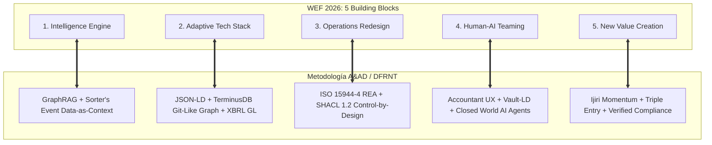

# Benchmark Report: WEF AI-First Operating System vs. A&AD Methodology

**Fecha:** Agosto 2026  
**Ubicación:** `c:\Users\IPHIX\Documents\Projects\DFRNT\Documentacion\WEF`  
**Documento Analizado:** *The AI-First Operating System: A Blueprint for Operating and Business Model Innovation* (World Economic Forum & Kearney, June 2026)  
**Marco Comparado:** *Accounting & Audit by Design (A&AD / AI2Accountants / aad-methodology)*  

---

## 1. Resumen Ejecutivo

El White Paper del World Economic Forum (**WEF June 2026**) define el cambio paradigmático que sufren las organizaciones al migrar de un modelo **"AI-Enabled"** (IA agregada como capa superficial a procesos legados) a un modelo **"AI-First"** (organizaciones diseñadas desde sus cimientos en torno a un Motor de Inteligencia). 

Por su parte, **A&AD (Accounting & Audit by Design)** representa la **instanciación científica y de alta precisión** de este blueprint para los dominios contable, financiero, de gobernanza y auditoría forense. A&AD operacionaliza el modelo conceptual del WEF combinando la **Teoría de la Contabilidad y el Control** (Sorter, Ijiri, McCarthy) con la **Pila Semántica de Grafos de Conocimiento** (ISO 15944-4 REA, XBRL GL, JSON-LD, SHACL 1.2 y TerminusDB vía DFRNT).

Este benchmark evalúa la alineación, extensiones y ventajas competitivas de A&AD frente a los 5 bloques fundamentales del WEF y su *AI-First Business Model Canvas*.

---

## 2. Mapa Conceptual de Coincidencias



---

## 3. Evaluación Detallada por Bloque del Blueprint WEF

### Bloque 1: Motor de Inteligencia (Intelligence Engine)

* **Propuesta WEF:** El motor de inteligencia se sitúa en el centro de la empresa como un *flywheel* compuesto por tres bucles continuos de retroalimentación:
  * **Speed Loop:** Aceleración del descubrimiento e inferencia autónoma.
  * **Scale Loop:** Plataforma multiuso vinculada a métricas de negocio.
  * **Scope Loop:** Recombinación de capacidades para expandirse a nuevos dominios.
* **Respuesta & Solución A&AD:**
  * A&AD implementa el Motor de Inteligencia mediante **GraphRAG (Graph-Augmented Retrieval)** alimentado por el principio de **"An Events Approach" de Sorter (1969)** (*Data-as-Context*).
  * **Speed Loop en A&AD:** Captura eventos económicos en su nivel más granular (vía XForms / ISO 21378 ADCS) sin agregaciones prematuras. Las reglas de inferencia detectan anomalías y desviaciones en tiempo real.
  * **Scale Loop en A&AD:** Mapeo normalizado vía **XBRL GL (`gl-cor` / `gl-bus`)**, permitiendo que los mismos modelos de análisis operen sobre múltiples jurisdicciones, filiales o ERPs sin reescritura.
  * **Scope Loop en A&AD:** La ontología **REA (ISO 15944-4)** unifica la contabilidad financiera tradicional con la contabilidad de sostenibilidad (ESG) y el modelado predictivo de contratos (**ACTUS**), expandiendo el alcance operativo del motor de inteligencia a toda la cadena de valor.

---

### Bloque 2: Pila Tecnológica Adaptativa (Adaptive AI Technology Stack)

* **Propuesta WEF:** Una arquitectura modular de 6 capas: *Infrastructure, Data, Context Layer (Ontologías, MCP, APIs), Models, Orchestration, User-facing Interfaces*, que permite intercambiar componentes (modelos, conectores) sin reconstruir el sistema.
* **Respuesta & Solución A&AD:**
  * **Context Layer & Ontología:** A&AD utiliza una pila ontológica formal basada en **ISO 21838 (BFO - Basic Formal Ontology)** e **ISO 15944-4 (REA)** integradas mediante **JSON-LD** y registros **Model Context Protocol (MCP)**.
  * **Data Layer & Persistencia:** Implementación sobre **TerminusDB a través de DFRNT**, garantizando:
    * **Determinismo de URIs (`@id`)**: Ingesta idempotente (*Upserts* reproducibles).
    * **Auditoría Forense Bitemporal**: Control de versiones de datos tipo Git (Commits, Branching, Merging) nativo en el grafo.
  * **Orquestación y Modelos:** Despliegue agnóstico donde los LLMs generan consultas **WOQL / GraphQL** validadas contra el esquema del grafo antes de ejecutarse, eliminando alucinaciones estructurales.

| Capa Stack WEF | Estándar / Componente en A&AD |
| :--- | :--- |
| **Interfaces** | Portal de Auditoría HTML5 Portable + Accountant-Centric UX + Vault-LD (.md) |
| **Orquestación** | MCP Registry + Routing agnóstico + Validación sintáctico-semántica |
| **Modelos** | LLMs de frontera (razonamiento) + SLMs especializados (clasificación PUC/IFRS) |
| **Context Layer** | Ontología REA (ISO 15944-4) + SHACL 1.2 + Model Context Protocol |
| **Data Layer** | XBRL GL + UBL 2.1 + JSON-LD Idempotente |
| **Infraestructura** | TerminusDB (Grafo Git-like) + BaseX (XQuery/ADCS) en DFRNT |

---

### Bloque 3: Rediseño Operativo y Legibilidad (Operations Redesign)

* **Propuesta WEF:** Asignación estratégica de la inteligencia como si fuera capital (Head = Objetivos, Arms = Workflows, Cups = Tareas). Medición por la Escala de Agencia Humana (HAS H1 a H5). Codificación del negocio mediante una **Ontología** (ej. Palantir Ontology) para hacer el negocio "legible" para la IA.
* **Respuesta & Solución A&AD:**
  * **Legibilidad Negocial Superior:** Mientras WEF propone ontologías ad-hoc, A&AD utiliza la ontología internacional estandarizada **ISO/IEC 15944-4 (Open-edi Business Transaction Ontology)**. El negocio se vuelve 100% legible para la IA en 3 capas explícitas:
    1. **Data Layer:** Entidades (`EconomicResource`, `EconomicAgent`, `Document`).
    2. **Logic Layer:** Relaciones y restricciones de dualidad contable (`duality`, `governedByContract`).
    3. **Action Layer:** Acciones permitidas y disparadores de workflow.
  * **Shift-Left / Control by Design:** Transformación del control interno tradicional (COSO/COBIT reactivo y por muestreo) a **Control Incorporado por Diseño**:
    * Reglas **SHACL 1.2** actúan en el punto de ingesta ($1 Prevención vs $100 Auditoría Ex-post).
  * **Niveles de Agencia (HAS):**
    * **H1/H2 (Autónomo):** Conciliación bancaria rutinaria y mapeo XBRL GL.
    * **H3 (Co-piloto):** Análisis forense de anomalías y deterioro NIIF 9.
    * **H4/H5 (Supervisión Humana):** Juicios contables de alta complejidad y firma probatoria.

---

### Bloque 4: Trabajo en Equipo Humano-IA (Human-AI Teaming)

* **Propuesta WEF:** Estructuras organizacionales federadas (CEO $\rightarrow$ CAIO $\rightarrow$ BU CAIOs), perfil de talento en forma de T (*T-shaped talent*), pods multifuncionales y normas de equipo centradas en la calidad e iteración rápida.
* **Respuesta & Solución A&AD:**
  * **Accountant-Centric UX (Semantic Bridge):** A&AD elimina la barrera técnica entre contadores/auditores y la pila semántica. La interfaz traduce automáticamente el vocabulario contable clásico (Débitos, Créditos, Cuentas PUC) a la estructura ontológica del grafo (Recursos, Eventos, Agentes).
  * **Asistentes de Auditoría bajo CWA (Closed World Assumption):** Los agentes IA operan estrictamente bajo la Asunción de Mundo Cerrado sobre el Grafo de Conocimiento, impidiendo que la IA invente transacciones o relaciones inexistentes.
  * **Papeles de Trabajo Vivos (Vault-LD):** Los auditores colaboran en archivos `.md` estructurados con encabezados YAML-LD, permitiendo versionamiento simultáneo leíble por humanos y procesable por agentes IA.

---

### Bloque 5: Creación de Nuevo Valor y Canvas AI-First (New Value Creation)

* **Propuesta WEF:** Extensión del *Business Model Canvas* de Osterwalder con los 5 fundamentales AI-First. Madurez de comercio agéntico (Niveles 1 a 5).
* **Respuesta & Solución A&AD:**
  * **Partida Triple e Impulso Contable (Ijiri 1975):** A&AD lleva la creación de valor financiero a un nuevo nivel midiendo no solo el *Stock* (Activo/Pasivo) y el *Flujo* (Ingreso/Gasto), sino el **Impulso / Aceleración Financiera (*Momentum Accounting*)**:
    1. **Stock:** Nodos `rea:EconomicResource`.
    2. **Flujo:** Nodos `rea:EconomicEvent` y asientos `XBRL GL`.
    3. **Impulso:** Contratos `ACTUS` y compromisos `rea:Commitment`.
  * **Continuous Assurance / Invisible Audit:** La auditoría deja de ser un evento anual costoso y se convierte en una **capa de infraestructura invisible y continua** que genera confianza instantánea para inversionistas, bancos y reguladores.

---

## 4. Matriz Comparativa Sintética (Scorecard)

| Criterio de Evaluación | Blueprint WEF (2026) | Metodología A&AD (2026) | Veredicto & Sinergia |
| :--- | :--- | :--- | :--- |
| **Enfoque Arquitectónico** | Macromodelo transversal para cualquier industria. | Especificación profunda para Contabilidad, Auditoría y GRC. | **Complementario:** WEF ofrece el marco directivo; A&AD entrega el motor ejecutable. |
| **Estándar Ontológico** | Ontologías genéricas o propietarias (ej. Palantir). | Estándares ISO (ISO 15944-4 REA, ISO 21838 BFO). | **Ventaja A&AD:** Interoperabilidad internacional e inmutabilidad normativa. |
| **Normalización de Datos** | Data Flywheel genérico (estructurado + sintético). | XBRL GL + UBL 2.1 + ISO 21378 ADCS. | **Ventaja A&AD:** Garantiza 1:1 de paridad con requerimientos regulatorios NIIF/Tax. |
| **Gobernanza y Control** | Evaluaciones y guardarraíles cuantitativos. | SHACL 1.2 + Control by Design + Determinismo (`@id`). | **Ventaja A&AD:** Prevención determinista a nivel de ingesta ($1 Shift-Left). |
| **Confianza e IA** | Transparencia, visibilidad y trazabilidad. | GraphRAG bajo Asunción de Mundo Cerrado (CWA). | **Ventaja A&AD:** Eliminación matemática de alucinaciones financieras. |
| **Rendición de Cuentas** | Enfoque en productividad y ARR. | Teoría de Ijiri (Accountability y Fuerza Probatoria). | **Ventaja A&AD:** Inviolabilidad forense de evidencias ante tribunales y entes de control. |

---

## 5. Mapeo en el AI-First Business Model Canvas (Osterwalder / WEF + A&AD)

```markdown
┌─────────────────────────────────────────────────────────────────────────────────────────┐
│                               AI-FIRST BUSINESS MODEL CANVAS                            │
├──────────────────────────┬──────────────────────────┬───────────────────────────────────┤
│ KEY PARTNERS             │ KEY ACTIVITIES           │ VALUE PROPOSITION                 │
│ • DFRNT / TerminusDB     │ • Ingesta idempotente    │ • Auditabilidad continua 24/7     │
│ • XBRL International     │ • Validación SHACL 1.2   │ • Cero alucinaciones en cifras    │
│ • ACTUS Financial Corp   │ • Traza bitemporal Git   │ • Real-Time Momentum Accounting   │
├──────────────────────────┼──────────────────────────┼───────────────────────────────────┤
│ KEY RESOURCES            │ KEY RESOURCES (Cont.)    │ CUSTOMER RELATIONSHIPS            │
│ • Ontología ISO 15944-4  │ • DFRNT Graph Schema     │ • Portal HTML5 Interactivo        │
│ • Vault-LD (.md/YAML-LD) │ • Reglas SHACL 1.2       │ • Accountant-Centric UX           │
├──────────────────────────┴──────────────────────────┼───────────────────────────────────┤
│ COST STRUCTURE                                      │ REVENUE STREAMS                   │
│ • Prevención Shift-Left ($1 vs $100 ex-post)        │ • Servicios de Assurance Continuo │
│ • Optimización de compute vía GraphRAG preciso      │ • Monetización de datos confiables│
└─────────────────────────────────────────────────────┴───────────────────────────────────┘
```

---

## 6. Conclusiones y Recomendaciones Estratégicas

1. **A&AD es el Sistema Operativo AI-First de la Contabilidad:** El trabajo del WEF confirma que las organizaciones del futuro deben articularse en torno a un motor de inteligencia ontológico. A&AD demuestra cómo construir exactamente dicho motor para el dominio financiero y de auditoría.
2. **Adopción de Guardarraíles Semánticos Fuertes:** Se recomienda utilizar la especificación A&AD (JSON-LD + TerminusDB + SHACL 1.2) para implementar los bloques 1, 2 y 3 del WEF, evitando ontologías propietarias cerradas que generen dependencia de proveedor (*vendor lock-in*).
3. **Escalamiento del Control by Design:** Reemplazar el monitoreo reactivo por validación en ingesta, reduciendo costos operativos de auditoría y aumentando la confianza de los stakeholders.
