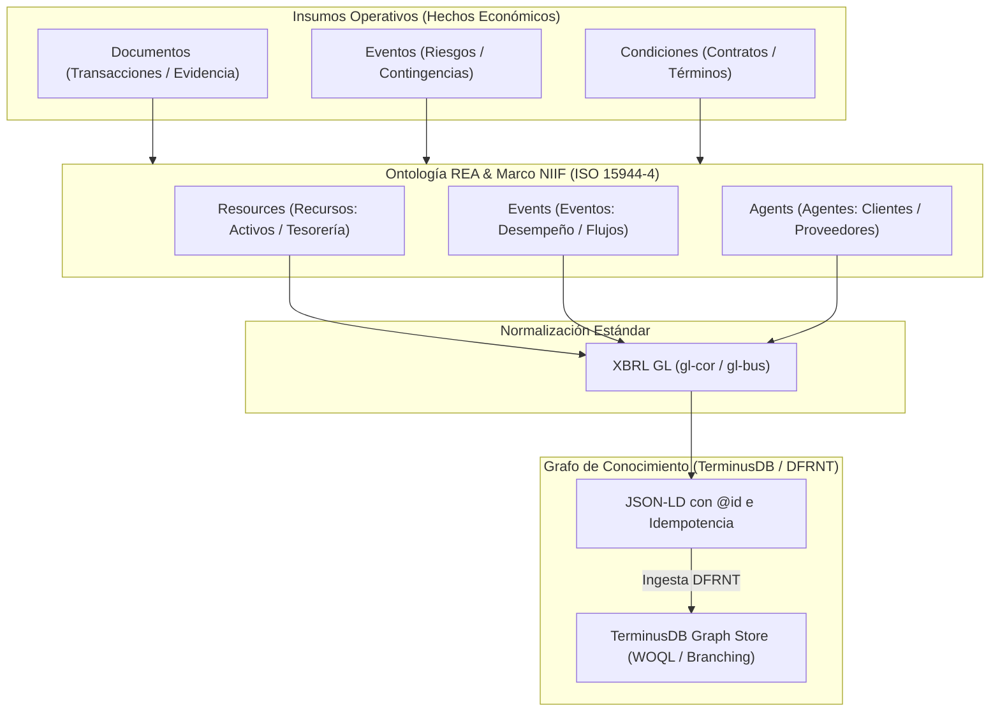

# Arquitectura Semántica Contable: REA, XBRL GL, JSON-LD y TerminusDB via DFRNT

## 1. Visión General
Esta arquitectura conecta la teoría ontológica de la contabilidad (**REA** - Resource-Event-Agent, ISO/IEC 15944-4) con los marcos regulatorios internacionales (Marco Conceptual NIIF/IFRS), los estándares de intercambio financiero (**XBRL GL**) y la tecnología de grafos de conocimiento (**JSON-LD + TerminusDB** integrado mediante **DFRNT**).

Permite representar cómo cada hecho económico modifica la posición financiera, el desempeño financiero o la capacidad de generar flujos de efectivo de una entidad.

---

## 2. Los Componentes del Stack

### A. Capa de Ontología Económica (REA + NIIF / ISO 15944-4)
* **Recursos (Resources)**: Bienes, derechos y capacidades económicas que la entidad controla o posee (efectivo, inventarios, propiedad, instrumentos financieros, derechos contractuales).
* **Eventos (Events)**: Transacciones u ocurrencias que modifican los recursos. Mapean directamente hacia los criterios NIIF:
  * **Posición Financiera**: Variaciones en Activos, Pasivos y Patrimonio (Estado de Situación Financiera).
  * **Desempeño Financiero**: Reconocimiento de Ingresos y Gastos (Estado de Resultados).
  * **Capacidad de Generar Flujos de Efectivo**: Entradas y salidas netas de tesorería (Estado de Flujos de Efectivo).
* **Agentes (Agents)**: Sujetos de derecho y partes involucradas (clientes, proveedores, empleados, entidades reguladoras, la propia entidad).

### B. Triada Operativa de Insumos
1. **Documentos (Transacciones / Evidencia Probatoria)**:
   * Representan hechos económicos consumados.
   * Ejemplos: Facturas electrónicas UBL, comprobantes de egreso, notas débito/crédito, extractos bancarios.
2. **Eventos (Riesgos / Contingencias)**:
   * Factores de incertidumbre u ocurrencias operativas que impactan la valoración o la recuperabilidad de los recursos.
   * Ejemplos: Deterioro de activos (NIIF 9 / NIC 36), provisiones litigiosas (NIC 37), fluctuaciones de tipo de cambio.
3. **Condiciones (Contratos / Derechos y Obligaciones)**:
   * Acuerdos legales que establecen compromisos futuros, derechos de cobro y obligaciones de desempeño.
   * Ejemplos: Contratos de arrendamiento (NIIF 16), contratos con clientes (NIIF 15), derivados financieros.

### C. Capa de Transporte y Normalización (XBRL GL - Global Ledger)
* **Función**: Sirve como vehículo intermedio estandarizado e internacional para estructurar los datos del libro mayor y auxiliares.
* **Mapeo de Estructuras**:
  * `entryHeader`: Agrupa la cabecera de la transacción / comprobante.
  * `entryDetail`: Almacena el detalle de las líneas de asiento contable.
  * `account`: Identifica la cuenta del plan contable (PUC / IFRS Taxonomy).
  * `amount`: Define el valor cuantitativo del recurso expresado en la moneda correspondiente.
  * `identifier`: Asigna los Agentes (NIT/TaxID) asociados a cada línea.

### D. Capa de Inyección Semántica y Grafo (JSON-LD + TerminusDB via DFRNT)
* **Transformación a JSON-LD**:
  * Expresión del modelo XBRL GL en formato de tripletas semánticas RDF/JSON-LD.
  * Asignación de URIs deterministas mediante `@id` (basado en GUIDs o hashes únicos de la transacción) para garantizar **idempotencia** en las cargas.
  * Definición explícita de tipos con `@type` y relaciones semánticas (`has_agent`, `modifies_resource`, `governed_by_contract`).
* **Persistencia en TerminusDB (a través de DFRNT)**:
  * Almacenamiento en Grafo de Conocimiento navegable.
  * Control de versiones tipo Git (Commits, Branching, Merging) nativo en TerminusDB para auditoría forense e inmutabilidad.
  * Consultabilidad avanzada mediante **WOQL** (Web Object Query Language) y **GraphQL**.

---

## 3. Diagrama de Flujo de Datos

---

## 4. Claves Tácticas para Profundizar

1. **Determinismo de URIs (`@id`)**:
   * Evita identificadores aleatorios en la conversión JSON-LD para que cada re-ingesta actúe como un *Upsert* idempotente en TerminusDB.
2. **Polimorfismo con `@inherits` en DFRNT**:
   * Modelar `AccountEntry` como clase base y derivar especificaciones (`TaxEntryDetail`, `ContractualCondition`), garantizando flexibilidad en las consultas del grafo.
3. **Auditoría Forense y Traza Bidireccional**:
   * Navegación fluida en el grafo desde el Contrato (Condición) $\rightarrow$ Factura (Documento) $\rightarrow$ Asiento XBRL GL $\rightarrow$ Recurso (Activo) $\rightarrow$ Agente (Contraparte).
