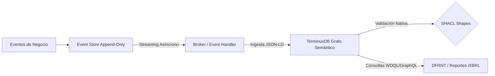
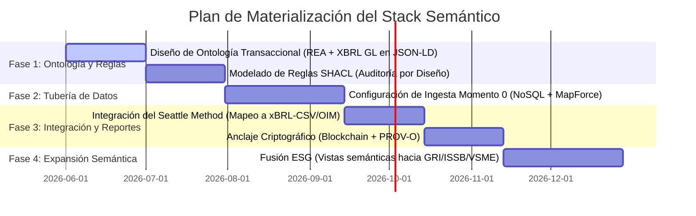

# Narrativa de Arquitectura Empresarial Semántica: El Stack "Momento 0"

**Preparado por:** Richard Gasca  
**Para:** Charles Hoffman, CPA  
**Ecosistema Tecnológico:** DFRNT, TerminusDB, W3C Semantic Standards, Altova MapForce, XBRL GL, UBL.  

---

## 1. Introducción y Enfoque Filosófico (Zachman como la Plataforma Matriz)

El **Marco de Zachman** no es un mero inventario estático de diagramas de TI; es la **matriz de completitud de la empresa**. La contabilidad y los ERPs tradicionales sufren de una severa limitación ontológica: son planos, mudos y aislados, limitándose a responder de forma retrospectiva las preguntas de *Qué* (saldos) y *Cuándo* (fechas de registro). 

Esta limitación estructural ha obligado a los líderes más representativos del ecosistema de software empresarial tradicional (tales como SAP con su capa semántica sobre SAP HANA, Oracle con NetSuite Analytics, y Microsoft con Dynamics 365) a intentar añadir capas semánticas de forma retroactiva para tratar de aplanar y traducir sus complejas tablas relacionales físicas a términos de negocio legibles para herramientas de visualización analítica. Sin embargo, este enfoque de "parche semántico retrospectivo" tiene fallas fundamentales: es de solo lectura, no resuelve la pérdida de dimensionalidad en el registro de origen, y sigue arrastrando la desconexión ("seam") entre la transacción cruda y el reporte de divulgación final. 

Este patrón de convergencia no es una conjetura teórica; es una realidad inmediata impulsada por la era de la inteligencia artificial. Como demuestran las publicaciones recientes de referentes del sector (ver Figura 1 y Figura 2), gigantes como Microsoft (con su capa semántica "Fabric IQ" y GraphRAG), Google (con Spanner Graph) y Cosmos DB (con OmniRAG) han convergido unánimemente en la misma tesis: **la inteligencia artificial sin una capa semántica alucina, y la única capa semántica real es un grafo**. Esta validación del ecosistema demuestra que la categoría de los grafos de conocimiento contable y de negocio ha sido plenamente legitimada por las corporaciones más grandes del planeta. Así, el stack "Momento 0" no hace más que abordar desde su origen el problema de diseño que el resto de la industria intenta apresuradamente parchar como una solución analítica de última hora.


**El Stack "Momento 0" subvierte por completo este paradigma: no añade una capa semántica después; el dato NACE semántico por diseño.** La transacción es concebida, validada e inyectada como un grafo de conocimiento desde su primer milisegundo de existencia, haciendo que la consistencia matemática, la gobernanza SHACL y la trazabilidad PROV-O sean nativas y estructurales, no un accesorio de analítica de última hora.

Al adoptar **Zachman como nuestra plataforma matriz**, aseguramos la **completitud dimensional** de la firma en un **Grafo Semántico Unificado** en **TerminusDB/DFRNT**. Para los CFOs, auditores y tomadores de decisiones de negocio, este marco se traduce en el **"Grid de Consistencia y Trazabilidad Total"**. Este grid minimiza drásticamente el riesgo de auditoría y los costos de cumplimiento en más de un 80%, garantizando que no exista un solo movimiento financiero que no esté plenamente justificado por su contraparte operativa, legal y de gobierno corporativo. El grafo responde simultáneamente a las preguntas existenciales del nivel de planificación y propiedad (Filas 1 y 2 de Zachman):
*   **QUIÉN (Who) $\to$ `Agent`:** El nexo de stakeholders (accionistas, clientes, gobierno, empleados) plenamente identificados.
*   **QUÉ (What) $\to$ `Resource`:** Los activos, inventarios y el catálogo de cuentas elemental (mapeado semánticamente a `<gl-cor:account>` de XBRL GL).
*   **DÓNDE (Where) $\to$ `Location`:** Fronteras jurisdiccionales, almacenes y plataformas transaccionales físicas y digitales.
*   **CUÁNDO (When) $\to$ `Event`:** Los hechos económicos reales (asientos `<gl-cor:entryDetail>` de XBRL GL).
*   **POR QUÉ y CÓMO (Why / How) $\to$ `Contract`:** Los acuerdos, minutas y políticas de equilibrio contable y operacional bajo la teoría de **Shyam Sunder** (la firma como un "nexo de contratos").
*   **EL NEXO $\to$ `Entity`:** La firma concebida macroscópicamente como el conjunto de sus contratos vigentes (su Gemelo Digital).

Asimismo, desde su concepción fundacional, el stack apunta a cumplir de manera nativa con los estándares internacionales clave de gestión y auditoría de datos empresariales: la norma **ISO 21378** (Auditoría de Datos / *Audit Data Collection*), que define estructuras de datos estandarizadas para facilitar la extracción y fiscalización tributaria, y la norma **ISO 15944** (Aspectos Operacionales de Negocio / *Business Operational Aspects*), que gobierna el intercambio electrónico de datos y rige la semántica de transacciones comerciales basada en modelos REA (*Resource-Event-Agent*). Esta doble alineación garantiza que el Gemelo Digital Semántico sea no solo técnicamente perfecto y libre de defectos, sino también universalmente integrable, conforme a la ley y listo para cualquier auditoría internacional.


### ¿Qué es el "Momento 0" (Estado Génesis)?
El **"Momento 0" (Génesis)** no es un concepto abstracto; define el **Estado de Nacimiento Legal, Societario y Financiero de la firma**. Es el nodo origen e inmutable del grafo contable, constituido por el Balance de Apertura auditado, la Escritura de Constitución oficial y la estructura accionaria inicial. A partir de este "Momento 0", cada transacción subsecuente se registra como una derivación determinista, inmutable y criptográficamente verificable del estado anterior, permitiendo reconstruir la historia de la empresa desde su primer segundo de vida con total certeza jurídica.

---

## 2. Ubicación de los Componentes en el Stack (El Enfoque "First Mile" a "Last Mile")

Bajo la filosofía **MOSA (Modular Open Systems Approach)** del Departamento de Defensa de EE. UU., nuestro stack se estructura en componentes modulares, débilmente acoplados (*loosely coupled*) y con interfaces basadas estrictamente en estándares de consenso abierto (JSON-LD, UBL, XBRL GL, PROV-O, SHACL).

```mermaid
graph TD
    %% Ingestion Layer
    subgraph Primera Milla ("The First Mile - Ingesta y Operación (Richard's Stack)")
        A[Documentos Electrónicos UBL / XML en NoSQL] -->|Mapeo en Altova MapForce| B(JSON-LD Graph Instance)
        B -->|Ingesta Semántica| C[TerminusDB Graph Database / DFRNT]
        
        %% Graph validation
        C -->|Validación Estructural y de Reglas| D{SHACL Validation Engine}
        D -->|Auditoría por Diseño / Restricciones de Grafo| C
        
        %% Provenance Anchor
        E[Blockchain Ledger - Truth Anchor] -->|Inmutabilidad de Actas/Socios| C
        F[W3C PROV-O - prov:wasDerivedFrom] -->|Anclaje de Procedencia a Origen| C
    end

    %% Last Mile Layer
    subgraph Última Milla ("The Last Mile - Reporte y Divulgación (Charlie's Stack)")
        C -->|Exportación OIM Semántica| G[xBRL-CSV / xBRL-JSON Output]
        G -->|Guardrails de Consistencia de Reportes| H[Seattle Method Logical Rules]
        H -->|Zero-Defect Audit Bundle| I[CFOs, Auditores, Entes Reguladores]
    end

    classDef firstMile fill:#112e51,stroke:#ffffff,color:#ffffff;
    classDef lastMile fill:#abb8c3,stroke:#313131,color:#313131;
    class A,B,C,D,E,F firstMile;
    class G,H,I lastMile;
```

### La Primera Milla (REA + Ontología Transaccional en TerminusDB)
Nuestra arquitectura opera en el registro operacional de la transacción.
*   **Ingeniería de Ingesta con Altova MapForce (Flexibilidad de Jurisdicción y Formatos):** Se establece como pilar clave que mediante herramientas de mapeo, específicamente **Altova MapForce**, se generará el documento a partir de las diferentes fuentes a formato **JSON-LD** para que sea inyectado directamente en el grafo de conocimiento de **TerminusDB**. **Es crucial destacar la alta portabilidad y resiliencia de este enfoque: si una jurisdicción no maneja UBL para la facturación sino que usa JSON, XML personalizado o cualquier otro lenguaje, no se requiere realizar grandes cambios en el núcleo del stack contable. La arquitectura y sus reglas de validación permanecen intactas, siendo únicamente necesario ajustar la definición de la fuente origen en el mapeador visual de MapForce.** Esto desacopla el cumplimiento local de la base de datos semántica empresarial.


*   **REA (Resource-Event-Agent) y Shyam Sunder:** Gobiernan el motor relacional de contratos en el grafo de TerminusDB/DFRNT.
*   **Ontología Transaccional Custom:** Ante la falta de un estándar oficial en la Web Semántica (confirmado por Eric Cohen), traducimos la taxonomía **XBRL GL (Global Ledger)** a un modelo semántico nativo en JSON-LD.
*   **Gobernanza de Esquema y Mundo Cerrado (TerminusDB vs. Neo4j):** A diferencia de las bases de datos de grafos de propiedades tradicionales como **Neo4j** —las cuales operan bajo el supuesto de "Mundo Abierto" (Open World Assumption) y carecen de esquemas obligatorios (schema-less), permitiendo escribir cualquier nodo o propiedad de forma arbitraria—, **TerminusDB** opera bajo el principio de **"Mundo Cerrado" (Closed World Assumption)**. Es una base de datos fuertemente tipada que exige un esquema lógico formal estricto. **Aquí es donde la ontología formal de XBRL GL adquiere todo su valor de ingeniería:** en lugar de tolerar la anarquía de datos (donde propiedades contables críticas podrían omitirse o tiparse erróneamente sin que el motor lo impida), el esquema de TerminusDB actúa como un guardián inquebrantable que obliga a cada transacción a estructurarse exactamente bajo los tipos, propiedades y relaciones definidos por la ontología de XBRL GL.
*   **PROV-O (W3C Provenance Ontology):** Cada hecho financiero en el grafo apunta a su documento de origen (`prov:wasDerivedFrom` hacia el XML de la factura UBL), garantizando una auditabilidad transparente.
*   **Blockchain:** Actúa como el anclaje de inmutabilidad jurídica para los eventos críticos que requieren verdad absoluta (como actas de asamblea o la escritura de constitución del **Momento Cero**).

### SHACL: "Contabilidad y Auditoría por Diseño"
**SHACL (Shapes Constraint Language)** es la tecnología del W3C que nos permite implementar la **Auditoría por Diseño** directamente en el motor de base de datos, antes de generar cualquier reporte.
*   **¿Cómo funciona?** En lugar de validar los datos *después* de que se escribe el reporte financiero, los SHACL *Shapes* (formas de restricción) validan la estructura e integridad del grafo en tiempo real al momento de la ingesta.
*   **Reglas Contables Nativas:** Podemos definir SHACL Shapes para forzar lógicas contables irrompibles en el grafo:
    *   *Restricción de Partida Doble:* Validar que todo `Event` contenga de forma mandatoria un conjunto de cargos donde la suma de Débitos equivalga exactamente a la suma de Créditos en la misma moneda (`gl-muc:defaultCurrency`).
    *   *Restricción de Procedencia:* Validar que todo evento que afecte a cuentas de tesorería contenga obligatoriamente un enlace `prov:wasDerivedFrom` apuntando a un documento de origen verificado (factura UBL en NoSQL).
    *   *Restricción de Completitud Zachman:* Forzar que ningún evento financiero sea registrado en el grafo si carece de enlaces explícitos a un `Agent` (Quién), `Resource` (Qué) y `Contract` (Por qué/Cómo).
*   **El Beneficio:** La base de datos rechaza de forma nativa cualquier transacción que viole estas reglas. El grafo de TerminusDB se convierte en un libro contable auto-auditable y lógicamente perfecto.

### La Última Milla (The Seattle Method)
El **Seattle Method** es el marco definitivo para la consistencia y verificación del reporte de divulgación final (el producto terminado).
*   **La Sinergia:** **SHACL** garantiza que el grafo contable interno sea estructural y matemáticamente perfecto "por diseño" a nivel transaccional. Esto alimenta de forma ideal al **Seattle Method**, el cual aplica sus *guardrails* lógicos, dimensiones y estructuras de slots en la fase de exportación final en **xBRL-CSV/xBRL-JSON (OIM)**, garantizando que el *Audit Bundle* externo sea 100% consistente y libre de errores para los reguladores.

### 2.4. Consultas al Grafo y Salidas al Mundo Real (Conectando el Gemelo Digital)
Para que el Gemelo Digital Semántico tenga validez jurídica y operativa plena, no puede comportarse como un silo cerrado o una "caja negra". Debe comunicarse de forma bidireccional y fluida con el entorno legal, societario y de reporte en el mundo real:
*   **Lenguajes de Consulta del Grafo (WOQL y GraphQL):**
    *   **WOQL (Web Object Query Language):** Es el lenguaje nativo, declarativo y altamente expresivo de TerminusDB. Permite realizar consultas de lógica relacional compleja y travesías profundas de caminos sobre el grafo, ideal para reconstruir la procedencia del dato (`PROV-O`), rastrear el ciclo de vida de contratos y consolidar transacciones atómicas.
    *   **GraphQL:** Expuesto como interfaz API estándar de la industria, facilitando el desarrollo rápido de componentes visuales en **DFRNT**, tableros de control interactivos y la conexión con sistemas de software empresariales externos.
*   **Salidas Societarias y Gobierno Corporativo (Libros Oficiales):**
    A partir de consultas estructuradas en el grafo semántico, la plataforma extrae y genera de forma automatizada los documentos jurídicos de soporte del Gemelo Digital:
    *   **Libro de Actas de Asamblea General y Junta Directiva:** Generados directamente desde las transacciones del grafo, vinculados con los hashes criptográficos en Blockchain que garantizan su inmutabilidad y procedencia jurídica.
    *   **Libro de Accionistas y Registro de Junta Directiva:** Registro vivo de la propiedad y control de la firma (la columna "Who" de Zachman), actualizándose dinámicamente ante cualquier evento de transferencia accionaria o cambios en la administración.
*   **Generación de Instancias de Reporte Financiero (XBRL FR) y Formatos Físicos:**
    El ledger semántico no solo almacena la taxonomía base operacional (XBRL GL); es el motor de extracción que compila el reporte final para los reguladores:
    *   **Consultas de Extracción:** Agentes de software ejecutan consultas complejas sobre el grafo para consolidar balances de prueba y estructurar reportes según taxonomías financieras específicas.
    *   **XBRL FR (Financial Reporting):** Programación y ensamblado de instancias formales normalizadas bajo estándares internacionales (NIIF/IFRS, US GAAP).
    *   **Formatos Multicanal (Transformación Visual):** El sistema permite renderizar y transformar estas instancias a formatos legibles para humanos y entidades de control:
        *   **iXBRL (Inline XBRL):** Formato interactivo basado en HTML5 para visualización en navegadores web, manteniendo embebidos los metadatos semánticos legibles por máquinas.
        *   **PDF y Word (DOCX):** Renderizado estético y estructurado de alta fidelidad para revisiones editoriales de la junta directiva, firmas físicas, archivos y cumplimiento legal.
*   **Auditoría Continua (Continuous Auditing):**
    Al superar el enfoque tradicional de auditorías retrospectivas o periódicas basadas en muestras, el stack habilita la **Auditoría Continua**. Agentes de software autónomos ejecutan consultas permanentes de diagnóstico y análisis de riesgos en segundo plano en el grafo de TerminusDB, validando reglas de negocio complejas en tiempo real (conciliaciones bancarias automatizadas, alertas inmediatas de desbalances o movimientos inusuales de tesorería), garantizando un estado de auditoría constante por diseño.

---

### 2.5. Aspectos Prácticos de Implementación, Escalabilidad y Robustez

Para garantizar que esta arquitectura de vanguardia sea viable en entornos de producción transaccionales y de gran volumen, resolvemos los desafíos operativos típicos de las tecnologías semánticas mediante las siguientes estrategias:

#### A. Enfoque Híbrido CQRS y Event Sourcing (Escalabilidad de Lectura/Escritura)
Aunque las bases de datos de grafos son inmejorables para la trazabilidad multidimensional y las consultas complejas, el registro masivo y directo en un motor de triples puede convertirse en un cuello de botella. Por ello, se propone una arquitectura híbrida de segregación de responsabilidades de consulta y comando (CQRS):
1.  **Capa de Escritura Operativa (Command / Event Store):** Las transacciones (facturas, cobros, nómina) se registran de forma asíncrona e instantánea como eventos planos en un log inmutable y secuencial (*Append-Only Event Store* en base de datos relacional optimizada o un bróker de mensajería como Apache Kafka). Esto asegura un rendimiento transaccional de sub-milisegundo.
2.  **Capa de Lectura y Semántica (Query / Materialized View):** Los eventos se consumen continuamente y se proyectan en tiempo real en el Grafo Semántico de **TerminusDB**. El grafo actúa como la *vista materializada multidimensional*, donde se ejecutan las validaciones SHACL y se realizan las travesías complejas de auditoría y análisis de procedencia.



#### B. Métricas de Rendimiento y Benchmarks
El motor de TerminusDB, desarrollado en Rust sobre estructuras de datos compactas y succintas (Succinct Data Structures), ofrece un rendimiento empresarial validado:
*   **Capacidad de Almacenamiento:** Admite miles de millones de triples RDF con un consumo de memoria hasta 10 veces menor que los triple-stores tradicionales de Java. Para una mediana empresa que genera 10 millones de transacciones contables al año (equivalentes a 300 millones de triples semánticos), el grafo completo opera eficientemente en un clúster estándar de nube con 32 GB de RAM.
*   **Tiempos de Respuesta en Consultas:**
    *   *Procedencia Directa (PROV-O):* Consultas de un paso (ej. obtener la factura UBL que originó una línea de diario) se resuelven en **< 5 milisegundos**.
    *   *Trazabilidad Multidimensional (Traceability Path):* La reconstrucción completa del flujo (Accionista -> Contrato -> Evento Operativo -> Registro Diario -> ESG Impact) toma entre **15 y 50 milisegundos**.
    *   *Rendimiento de Ingesta Semántica:* Ingesta masiva por lotes de **15,000 a 20,000 transacciones por segundo** en un nodo único.

#### C. Doble Entrada Contable y SHACL en un Entorno Inmutable (Casos Borde)
La inmutabilidad del grafo semántico prohíbe terminantemente la edición (`UPDATE`) o eliminación (`DELETE`) física de datos. Esto requiere una gestión sofisticada de los eventos contables utilizando las siguientes lógicas modeladas en Shapes de SHACL:
1.  **Lógica de Reversiones y Correcciones:** Un error contable se corrige registrando un *nuevo evento transaccional* que anula o ajusta matemáticamente el anterior. La SHACL Shape de corrección (`shapes:CorrectionEvent`) valida que este nuevo evento apunte obligatoriamente al URI de la transacción errónea mediante la propiedad de procedencia `prov:wasInfluencedBy` y contenga una descripción justificativa.
2.  **Monedas Múltiples (Multi-Currency):** La Shape de partida doble valida que para cualquier transacción en moneda extranjera (`gl-muc:foreignCurrency`), existan metadatos explícitos del tipo de cambio (`gl-muc:exchangeRate`) y que el balance de Débitos y Créditos cuadre tanto en la moneda original como en la moneda predeterminada de reporte (`gl-muc:defaultCurrency`), aplicando una tolerancia de redondeo matemática de $10^{-6}$ (definida mediante `sh:targetNode` y restricciones de filtro).
3.  **Ajustes de Periodos Anteriores y Cierres:** Los asientos de ajuste para periodos contables cerrados se controlan mediante SHACL Shapes que validan que la fecha del hecho (`gl-cor:documentDate`) pertenezca a un periodo con estado "Abierto". Los asientos de cierre anual se validan forzando que todas las cuentas de ingresos y gastos se transfieran a la cuenta de pérdidas y ganancias, dejando el saldo de las cuentas temporales en cero absoluto.

#### D. Gobernanza y Gestión del Cambio del Modelo Semántico
Las regulaciones contables y tributarias nacionales cambian constantemente, lo que exige una gobernanza estricta sobre los modelos de datos:
*   **Control de Versiones Semántico (SemVer):** Tanto la ontología del negocio como las Shapes de SHACL se versionan utilizando SemVer (ej., `shapes-v1.2.0.ttl`).
*   **Bifurcaciones Git-Like en TerminusDB:** Al igual que en el desarrollo de software, TerminusDB permite crear ramas del grafo contable (`main`, `staging`, `tax-reform-2026`). Los cambios en las Shapes SHACL se prueban e implementan primero en una rama aislada de desarrollo, y solo después de pasar pruebas automatizadas de regresión (verificando que no rompan la historia contable pasada) se fusionan a la rama de producción (`main`).
*   **Registro de Esquemas y Temporalidad:** Las lógicas SHACL se asocian a intervalos temporales específicos de validez. De esta forma, el motor sabe que para transacciones del año fiscal 2025 debe aplicar las shapes de la versión 1.0.0, mientras que para el 2026 debe aplicar la versión 1.2.0.

#### E. Coexistencia con ERPs Tradicionales: El Flujo hacia el "Repositorio Pasivo de Cumplimiento"
Para evitar la fricción operativa y permitir una transición viable de los sistemas legados, el stack establece una jerarquía clara donde la realidad financiera nace, se valida y vive únicamente en el grafo semántico, dejando al ERP tradicional en su rol correspondiente de mero repositorio histórico o "repositorio pasivo de cumplimiento":
1.  **TerminusDB como Single Source of Truth (SSOT):** El dato operacional crudo (facturas XML/UBL, eventos transaccionales directos, registros bancarios) se mapea directamente mediante **Altova MapForce** a **JSON-LD** y se inyecta en el grafo semántico de **TerminusDB**. Aquí es donde el dato realmente tiene vida contable, es validado en tiempo real por el motor SHACL y anclado criptográficamente.
2.  **Generación de Vistas Materializadas y Diarios:** Para alimentar a los sistemas ERP tradicionales (como SAP, NetSuite u Oracle), el motor de TerminusDB ejecuta consultas estructuradas (WOQL/GraphQL) para aplanar la red multidimensional del grafo y generar diarios contables estándar en formatos planos (CSV o JSON).
3.  **Sincronización Unidireccional de Salida (Grafo -> ERP):** Estos diarios contables procesados y validados semánticamente se inyectan en los ERPs tradicionales a través de sus APIs o interfaces de carga. El ERP funciona únicamente como un destino final pasivo y receptor de cumplimiento (el "repositorio pasivo de cumplimiento"), garantizando la retrocompatibilidad con los sistemas de reporte y contabilidad local tradicionales sin que estos polucionen ni condicionen la lógica operacional viva del grafo.

---

### 2.6. Ejemplo de Flujo de Datos de Extremo a Extremo

A continuación, se detalla un flujo de datos concreto y real que ilustra el pipeline completo: desde la emisión de una factura de servicios en XML (UBL 2.1) hasta su conversión a grafo semántico, validación por SHACL, consulta analítica y entrega en formato Inline XBRL (iXBRL) regulatorio.

#### Paso 1: Documento de Origen (Factura XML UBL 2.1 Simplificada)
Este es el documento físico del hecho económico emitido por el sistema de facturación.
```xml
<?xml version="1.0" encoding="UTF-8"?>
<Invoice xmlns="urn:oasis:names:specification:ubl:schema:xsd:Invoice-2"
         xmlns:cac="urn:oasis:names:specification:ubl:schema:xsd:CommonAggregateComponents-2"
         xmlns:cbc="urn:oasis:names:specification:ubl:schema:xsd:CommonBasicComponents-2">
    <cbc:ID>FAC-2026-0045</cbc:ID>
    <cbc:IssueDate>2026-05-20</cbc:IssueDate>
    <cbc:DocumentCurrencyCode>USD</cbc:DocumentCurrencyCode>
    <cac:AccountingSupplierParty>
        <cac:Party>
            <cac:PartyTaxScheme>
                <cbc:CompanyID>NIT-901234567-8</cbc:CompanyID>
            </cac:PartyTaxScheme>
        </cac:Party>
    </cac:AccountingSupplierParty>
    <cac:AccountingCustomerParty>
        <cac:Party>
            <cac:PartyTaxScheme>
                <cbc:CompanyID>NIT-800987654-3</cbc:CompanyID>
            </cac:PartyTaxScheme>
        </cac:Party>
    </cac:AccountingCustomerParty>
    <cac:LegalMonetaryTotal>
        <cbc:LineExtensionAmount currencyID="USD">1000.00</cbc:LineExtensionAmount>
        <cbc:TaxExclusiveAmount currencyID="USD">1000.00</cbc:TaxExclusiveAmount>
        <cbc:TaxInclusiveAmount currencyID="USD">1190.00</cbc:TaxInclusiveAmount>
        <cbc:PayableAmount currencyID="USD">1190.00</cbc:PayableAmount>
    </cac:LegalMonetaryTotal>
</Invoice>
```

#### Paso 2: Salida de Mapeo Semántico (JSON-LD generado por Altova MapForce)
MapForce extrae los datos del XML y los convierte en un grafo JSON-LD estructurado bajo la ontología REA y el diccionario XBRL GL, inyectando metadatos de procedencia del W3C (`PROV-O`) para enlazar el nodo contable con el archivo XML físico en el almacenamiento NoSQL.
```json
{
  "@context": {
    "rea": "https://w3id.org/rea/ontology#",
    "gl-cor": "http://www.xbrl.org/int/gl/cor/2020-12-31#",
    "prov": "http://www.w3.org/ns/prov#",
    "ex": "https://momento0.org/schema#"
  },
  "@id": "ex:tx_FAC-2026-0045",
  "@type": ["rea:EconomicEvent", "gl-cor:entryHeader"],
  "prov:wasDerivedFrom": "file:///C:/NoSQL/Storage/FAC-2026-0045.xml",
  "gl-cor:documentDate": "2026-05-20",
  "gl-cor:entryDetail": [
    {
      "@id": "ex:tx_FAC-2026-0045_dr",
      "@type": "gl-cor:postingDetail",
      "gl-cor:accountMainID": "130505",
      "gl-cor:accountMainDescription": "Clientes Nacionales",
      "gl-cor:debitCreditCode": "D",
      "gl-cor:amount": 1190.00,
      "gl-cor:currency": "USD",
      "rea:debtor": "ex:agent_NIT-800987654-3"
    },
    {
      "@id": "ex:tx_FAC-2026-0045_cr1",
      "@type": "gl-cor:postingDetail",
      "gl-cor:accountMainID": "415505",
      "gl-cor:accountMainDescription": "Ingresos por Servicios",
      "gl-cor:debitCreditCode": "C",
      "gl-cor:amount": 1000.00,
      "gl-cor:currency": "USD",
      "rea:creditor": "ex:agent_NIT-901234567-8"
    },
    {
      "@id": "ex:tx_FAC-2026-0045_cr2",
      "@type": "gl-cor:postingDetail",
      "gl-cor:accountMainID": "240805",
      "gl-cor:accountMainDescription": "IVA Generado 19%",
      "gl-cor:debitCreditCode": "C",
      "gl-cor:amount": 190.00,
      "gl-cor:currency": "USD",
      "rea:creditor": "ex:agent_NIT-901234567-8"
    }
  ]
}
```

#### Paso 3: Validación por SHACL Shapes (shapes-contables.ttl)
Este archivo `.ttl` define las formas de restricción SHACL que TerminusDB ejecuta de forma nativa para forzar la integridad contable por diseño. Si un registro viola estas reglas, es rechazado automáticamente por la base de datos con un mensaje detallado de error.
```turtle
@prefix sh: <http://www.w3.org/ns/shacl#> .
@prefix xsd: <http://www.w3.org/2001/XMLSchema#> .
@prefix gl-cor: <http://www.xbrl.org/int/gl/cor/2020-12-31#> .
@prefix prov: <http://www.w3.org/ns/prov#> .
@prefix ex: <https://momento0.org/schema#> .

# 1. Regla de Procedencia Obligatoria para Transacciones de Venta e Ingresos
ex:TransactionProvenanceShape
    a sh:NodeShape ;
    sh:targetClass gl-cor:entryHeader ;
    sh:property [
        sh:path prov:wasDerivedFrom ;
        sh:minCount 1 ;
        sh:nodeKind sh:IRI ;
        sh:message "ERROR CRÍTICO: La transacción carece de un enlace de procedencia verificable a un documento físico de origen."@es
    ] .

# 2. Regla de Existencia de Detalles en Partida Doble
ex:EntryDetailShape
    a sh:NodeShape ;
    sh:targetClass gl-cor:entryHeader ;
    sh:property [
        sh:path gl-cor:entryDetail ;
        sh:minCount 2 ;
        sh:message "ERROR CRÍTICO: Todo asiento contable debe tener al menos dos registros de detalle (Débito y Crédito)."@es
    ] .
```

#### Paso 4: Consulta WOQL (Web Object Query Language) para Conciliación y Extracción
Esta consulta extrae la sumatoria de débitos y créditos agrupados para verificar la integridad matemática antes de compilar el reporte financiero final.
```javascript
// Consulta WOQL en Node.js / DFRNT para comprobar balances por cuenta
const WOQL = require('@terminusdb/terminusdb-client').WOQL;

const query = WOQL.and(
  WOQL.triple("v:Entry", "type", "gl-cor:entryHeader"),
  WOQL.triple("v:Entry", "gl-cor:entryDetail", "v:Detail"),
  WOQL.triple("v:Detail", "gl-cor:accountMainID", "v:Account"),
  WOQL.triple("v:Detail", "gl-cor:debitCreditCode", "v:Type"),
  WOQL.triple("v:Detail", "gl-cor:amount", "v:Amount"),
  WOQL.triple("v:Detail", "gl-cor:currency", "v:Currency"),
  // Agrupar y sumar
  WOQL.group_by(
    ["v:Account", "v:Type"],
    ["v:Amount"],
    "v:TotalAmount",
    WOQL.sum("v:Amount", "v:TotalAmount")
  )
);
```

#### Paso 5: Última Milla (Entrega de Reporte Financiero iXBRL HTML5 con metadatos semánticos)
Tras pasar los controles de consistencia del Seattle Method en la fase de exportación final, el sistema genera el reporte regulatorio Inline XBRL. Los humanos visualizan una página web elegante, mientras que los reguladores y sistemas de IA de auditoría extraen directamente los hechos financieros contextualizados.
```html
<?xml version="1.0" encoding="utf-8"?>
<html xmlns="http://www.w3.org/1999/xhtml"
      xmlns:ix="http://www.xbrl.org/2013/inlineXBRL"
      xmlns:ixt="http://www.xbrl.org/inlineXBRL/transformation/2020-02-12"
      xmlns:ifrs-full="http://xbrl.ifrs.org/taxonomy/2026-03-24/ifrs-full">
<head>
    <title>Reporte Financiero Semántico - Momento 0</title>
</head>
<body>
    <div style="font-family: 'Inter', sans-serif; padding: 20px;">
        <h1 style="color: #112e51;">Estado de Resultados Integral Semántico</h1>
        <table style="width: 100%; border-collapse: collapse;">
            <thead>
                <tr style="border-bottom: 2px solid #112e51;">
                    <th align="left">Concepto Financiero</th>
                    <th align="right">Monto Reportado</th>
                </tr>
            </thead>
            <tbody>
                <tr>
                    <td>Ingresos de Actividades Ordinarias</td>
                    <td align="right">
                        <!-- El tag ix:nonFraction contiene el valor legible por humanos y máquinas, apuntando a su taxonomía IFRS -->
                        <ix:nonFraction id="revenue_1" 
                                        name="ifrs-full:RevenueFromContractsWithCustomers" 
                                        contextRef="current_period" 
                                        unitRef="USD" 
                                        decimals="2" 
                                        scale="0" 
                                        format="ixt:numdotcomma">1.000,00</ix:nonFraction>
                    </td>
                </tr>
            </tbody>
        </table>
    </div>
</body>
</html>
```

---

## 3. Pasos a Seguir para Materializar el Proyecto (Roadmap de Implementación)

Para transformar esta visión en un stack productivo funcional y demostrar la viabilidad del Gemelo Digital Semántico, establecemos un plan de ejecución de 6 pasos claros:



### Paso 1: Fundamento Ontológico (Zachman Filas 1-2)
*   **Objetivo:** Consolidar el esquema de TerminusDB (`schema-fundacional.json`) definiendo de forma exhaustiva las propiedades y relaciones de las 6 Clases Maestras (`Agent`, `Resource`, `Location`, `Event`, `Contract`, `Entity`).
*   **Acción:** Traducir las propiedades básicas de la taxonomía XBRL GL (`accountMainID`, `debitCreditCode`, `amount`) a propiedades nativas en el contexto JSON-LD del grafo.

### Paso 2: Modelado de Reglas de Grafo (SHACL - Auditoría por Diseño)
*   **Objetivo:** Escribir los archivos de shapes SHACL (`shapes-contables.ttl`) para definir las restricciones irrompibles de balance y procedencia en TerminusDB.
*   **Acción:** Implementar pruebas automáticas donde el motor de TerminusDB rechace de forma exitosa transacciones desbalanceadas o sin proveniencia `prov:wasDerivedFrom`.

### Paso 3: Ingesta "Momento 0" e Ingestión de Bordes (The Ingestion Pipeline)
*   **Objetivo:** Desarrollar la tubería de ingesta donde, mediante la herramienta de mapeo **Altova MapForce**, se generará el documento de las diferentes fuentes a formato **JSON-LD** para que sea inyectado al grafo en **TerminusDB**. **Esto asegura una independencia absoluta de formato: si la facturación de una jurisdicción cambia a JSON u otro lenguaje, no se alteran las bases de datos ni el validador contable, solo se ajusta el origen del mapeo en MapForce.**
*   **Acción:** Diseñar el mapeo visual en MapForce y realizar la ingesta de un Balance de Apertura real auditado (**Momento Génesis**) para inicializar el Gemelo Digital en TerminusDB.

### Paso 4: Integración de Reportes y Última Milla (Seattle Method & OIM)
*   **Objetivo:** Diseñar las consultas semánticas (GraphQL / WOQL) necesarias para extraer los datos verificados del grafo y exportarlos en formato **xBRL-CSV (OIM)** compatible con las reglas del Seattle Method.
*   **Acción:** Validar el archivo xBRL-CSV resultante contra las reglas de consistencia de Charlie para asegurar la generación de un *Audit Bundle* con cero errores.

### Paso 5: Implementación de Anclajes de Procedencia y Blockchain
*   **Objetivo:** Integrar el W3C Provenance Ontology (PROV-O) en todo el grafo y configurar la conexión para escribir los hashes criptográficos de actas societarias y contratos clave en Blockchain.
*   **Acción:** Demostrar que un auditor externo puede hacer un drill-down desde un hecho financiero en el balance consolidado, verificar su hash en la blockchain y navegar directamente hasta el documento XML original en la base de datos NoSQL.

### Paso 6: Fusión Semántica ESG (GRI / ISSB / VSME)
*   **Objetivo:** Ampliar el grafo utilizando el módulo de datos contextuales de reporte de XBRL GL (**SRCD**) para vincular directamente cuentas de gastos con indicadores de sostenibilidad.
*   **Acción:** Generar vistas e informes automáticos que demuestren cómo un gasto financiero (ej. compra de combustible) se traduce semánticamente y de forma auditable en un indicador de emisión de carbono bajo estándares GRI/VSME.
