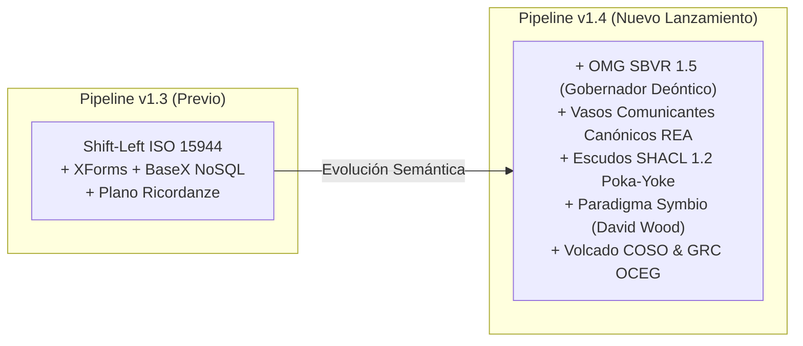

# Release Notes & Guía de Presentación: A&AD Pipeline Version 1.4

**Autor:** Richard Gasca (`co.auditoria@pm.me`)  
**Repositorio GitHub:** `github.com/AI2Accountans/AAxD`  
**Fecha de Lanzamiento:** 10 de Agosto de 2026  
**Ubicación del Canvas HTML v1.4:** `Canvas/v1.4/aad_going_concern_pipeline.html`

---

## 🚀 Resumen de los Logros Alcanzados en la Versión 1.4

La **Versión 1.4 del Pipeline A&AD (Going Concern Onboarding Pipeline)** representa el salto cuantitativo y cualitativo más importante en la historia del framework **Accounting & Audit by Design**.

Hemos pasado de un modelo que capturaba eventos en origen a un **Sistema Operativo de Inmunización Algorítmica y Gobernanza Deóntica Ejecutable**.



---

## 📌 Las 5 Novedades Arquitectónicas de la Versión 1.4

### 1. Gobernador Deóntico SBVR 1.5 (OMG Standard)
* Incorporación de **OMG SBVR** como la sombrilla de gobernanza transversal.
* Captura en origen de **Lenguaje Natural Controlado (CNL)** y operadores deónticos (`obligation`, `prohibition`, `permission`).
* Mapeo de `sbvrRuleID`, `sbvrRuleStatement`, `sbvrDeonticModality`, `sbvrRuleCategory` a través de tuplas XBRL GL (`gl-cor:qualifierEntry`, `gl-cor:detailComment`) hacia el nodo `sbvr:BusinessRule` en JSON-LD.

### 2. Vasos Comunicantes Canónicos REA (`owl:equivalentClass`)
* Eliminación de la reconciliación N-a-N al final del tubo.
* Mapeo sin colisión de la columna `reconciliationEquivalentClass` hacia `gl-cor:identifierCategory`, unificando Agentes y Recursos de ISO 15944-4 / UBL directamente en las tuplas contables de `EntryDetail`.

### 3. Inmunización Algorítmica Poka-Yoke con SHACL 1.2
* Validación ejecutable del **Mundo Cerrado (CWA)** en **TerminusDB**.
* Demostración empírica: Si un usuario intenta registrar un aporte de capital debitando una Cuenta por Cobrar (PUC 1305) violando una obligación SBVR de pago efectivo del 100% (`const-01`), **TerminusDB ejecuta un Rollback inmediato en la ingesta ($1 Shift-Left)**. La transacción corrupta no llega a existir dentro del Grafo.

### 4. Paradigma Symbio de David A. Wood (BYU / AICPA & CIMA)
* Integración del modelo **Symbio (Coordinación Simbiótica Humano-Agente de IA)** sobre el Grafo de Conocimiento.
* Articulación de los papeles de trabajo de evidencia narrativa en **Vault-LD (Tony Seale)** (Markdown + YAML-LD) vinculados al evento de constitución.

### 5. Volcado Completo del Marco COSO y el Modelo GRC de OCEG
* Las actividades de control de COSO y los 4 pilares de GRC de OCEG (*Learn, Align, Perform, Review*) volcados directamente en el sistema operativo computable del Grafo.

---

## 🎨 Cómo Presentar la Versión 1.4 a Clientes, Auditores y Comunidad

### Estrategia de Presentación Visual y Narrativa:

1. **El Canvas Interactivo HTML v1.4:**
   * Abre el archivo interactivo:  
     `file:///C:/Users/IPHIX/Documents/Projects/DFRNT/Canvas/v1.4/aad_going_concern_pipeline.html`
   * Utiliza la estética **Dark Glassmorphism** y los diagramas **Mermaid 10** en pantallas de alta resolución para mostrar el flujo extremo a extremo.

2. **La Estructura de la Demostración en 3 Actos:**
   * **Acto 1 (El Origen):** Muestra el formulario XForms / Google Sheets capturando la Escritura Pública y la regla SBVR (`obligation`).
   * **Acto 2 (La Transmutación):** Muestra el proyecto **Altova MapForce (`GS2XBRLGL2JSONLD_V2.mfd`)** generando el JSON-LD V2 con las tuplas XBRL GL y el nodo `sbvr:BusinessRule`.
   * **Acto 3 (La Inmunización):** Muestra cómo **TerminusDB / DFRNT** ejecuta la forma **SHACL 1.2** y aprueba el 100% de pago o rechaza la Cuenta por Cobrar 1305.

---

## 💻 Instrucciones para Actualizar en GitHub (`AI2Accountans/AAxD`)

Para subir estos avances al repositorio oficial de GitHub, ejecuta los siguientes comandos en tu terminal de **PowerShell**:

```powershell
# 1. Posicionarse en la raíz del proyecto
cd "C:\Users\IPHIX\Documents\Projects\DFRNT"

# 2. Agregar los archivos actualizados y nuevos
git add .gitignore
git add -f "Shift Left/SBVR"
git add "Canvas/v1.4"
git add "Momento0/Output"
git add "Momento0/Mapping/GS2XBRLGL2JSONLD_V2.mfd"
git add "Momento0/Taxonomy/JsonSchema/sunder_zachman_dfrnt_instances_v2.schema.json"
git add "Documentacion/Libro"
git add "Documentacion/Charles Hoffman"
git add "Documentacion/David A Wood"
git add "Documentacion/v1.4_pipeline_release_notes.md"

# 3. Crear el commit descriptivo de la versión 1.4
git commit -m "feat(v1.4): Release Pipeline v1.4 - OMG SBVR Deontic Governance, REA Bridge, SHACL 1.2 Poka-Yoke, Symbio Paradigm, and Book Chapter 15"

# 4. Enviar los cambios a la rama principal de GitHub
git push origin main
```

---

## 🏆 Conclusión

Con la **Versión 1.4**, el repositorio **`AAxD`** se consolida como la referencia mundial en la implementación práctica de **Accounting & Audit by Design (A&AD)**, uniendo la ontología REA, los estándares OMG SBVR, XBRL GL, W3C JSON-LD, SHACL 1.2, TerminusDB y la colaboración simbiótica de la IA.
