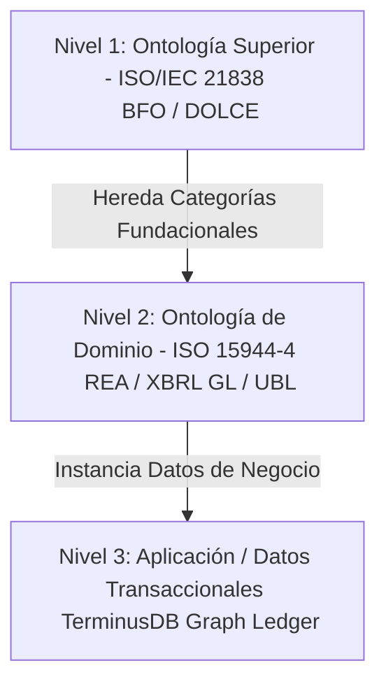

# Guía de Abordaje: ISO/IEC 21838 en el Stack Semántico "Momento 0"

Esta guía define qué es la norma internacional **ISO/IEC 21838 (Top-Level Ontologies - TLO)** y cómo debe incorporarse en la arquitectura empresarial y contable de **DFRNT / TerminusDB**, alineándose con los modelos **REA (Resource-Event-Agent)**, **Zachman**, y el **Seattle Method**.

---

## 1. ¿Qué es la Norma ISO/IEC 21838?

La norma **ISO/IEC 21838** es el estándar internacional para **Ontologías de Nivel Superior** (TLO, por sus siglas en inglés, o *Foundational Ontologies*). Su objetivo principal es actuar como una "raíz" conceptual común y neutra para que cualquier ontología de dominio específico (como contabilidad, finanzas, manufactura o medicina) pueda integrarse y ser semánticamente interoperable sin ambigüedades.

El estándar se divide en las siguientes partes clave:

| Parte del Estándar | Nombre / Ontología | Enfoque Filosófico y Estructural |
| :--- | :--- | :--- |
| **ISO/IEC 21838-1:2021** | **Requisitos (Requirements)** | Especifica las reglas formales (de documentación, lenguaje lógico y cobertura) que debe cumplir una ontología para ser certificada como una TLO válida. |
| **ISO/IEC 21838-2:2021** | **BFO (Basic Formal Ontology)** | Estructura el mundo bajo un enfoque **realista y formal**. Divide toda entidad en el universo en **Continuants** (objetos que duran en el tiempo) y **Occurrents** (procesos y eventos que ocurren en el tiempo). |
| **ISO/IEC 21838-3:2023** | **DOLCE (Descriptive Ontology for Linguistic and Cognitive Engineering)** | Adopta un enfoque **cognitivo, lingüístico y social**. Es excelente para modelar entidades abstractas, roles, contratos, intenciones y dinámicas de sistemas sociales y organizacionales. |
| **ISO/IEC 21838-4:2023** | **TUpper** | Ontología de nivel superior orientada a facilitar la consistencia en el diseño de ingeniería de sistemas y la integración de esquemas heterogéneos. |

---

## 2. Alineación del Stack "Momento 0" con ISO/IEC 21838

En el stack contable-financiero de la firma, no estamos inventando conceptos desde cero. En su lugar, el Gemelo Digital Semántico se construye sobre un árbol ontológico de tres niveles:



### A. Mapeo Conceptual: BFO (ISO 21838-2) $\to$ REA $\to$ Zachman
La división fundacional de **BFO** entre **Continuants** y **Occurrents** se alinea con precisión matemática con el modelo REA y las columnas de Zachman:

```
                  ┌─────────────────────────────────────────┐
                  │          ISO 21838-2 (BFO)              │
                  │              Entity                     │
                  └────────────────────┬────────────────────┘
                                       │
            ┌──────────────────────────┴──────────────────────────┐
            ▼                                                     ▼
     BFO:Continuant                                         BFO:Occurrent
 (Existe entero en el tiempo)                            (Ocurre en fases temporales)
            │                                                     │
    ┌───────┼───────┐                                             │
    ▼       ▼       ▼                                             ▼
  Agent  Resource Location                                      Event
  (Who)   (What)  (Where)                                      (When/How)
```

1. **`BFO:Continuant` (Continuo):** Entidades que mantienen su identidad a lo largo del tiempo.
   * **`BFO:Material Entity`** $\to$ **`REA:Resource` (Qué):** Dinero en caja, inventarios, activos fijos.
   * **`BFO:Material Entity` (u `Object`)** $\to$ **`REA:Agent` (Quién):** Clientes, Proveedores, Accionistas (`Who` de Zachman).
   * **`BFO:Spatial Region`** $\to$ **`Location` (Dónde):** Ubicación física de almacenes, plataformas en la nube o fronteras fiscales.
   * **`BFO:Generically Dependent Continuant`** $\to$ **`Contract` (Por qué/Cómo):** Acuerdos, regulaciones, derechos de propiedad intelectual, políticas contables.
2. **`BFO:Occurrent` (Ocurrente):** Entidades que se despliegan en el tiempo (tienen fases o partes temporales).
   * **`BFO:Process`** $\to$ **`REA:EconomicEvent` (Cuándo):** Asientos contables (`gl-cor:entryHeader`), transferencias bancarias, despachos de mercancía.

### B. Mapeo Conceptual: DOLCE (ISO 21838-3) $\to$ Shyam Sunder (Contratos)
Para la capa de **gobierno corporativo, contratos y roles**, **DOLCE** es un marco superior a BFO porque formaliza conceptos no físicos (sociales y cognitivos):
* **`DOLCE:Social Object` / `Agentive Social Object`:** Modela perfectamente los **Roles** que juegan los agentes (ej. un mismo agente físico puede ser "Accionista" en un contrato y "Proveedor" en otro).
* **`DOLCE:Description` / `Non-Agentive Social Object`:** Ideal para modelar el **Contrato** (el nexo de acuerdos de Shyam Sunder), las actas de junta directiva y las reglas lógicas que gobiernan la empresa.

---

## 3. ¿Cómo Abordarlo en tu Stack (TerminusDB + SHACL + MapForce)?

Para integrar la norma **ISO 21838** en tu flujo operativo de ingesta y validación contable, debes seguir un enfoque estructurado de desarrollo:

### Paso 1: Configurar el Espacio de Nombres (JSON-LD Context)
En la ingesta y definición del Grafo con **Altova MapForce**, debes incluir las URIs oficiales de BFO o DOLCE en el bloque de contexto `@context`:

```json
{
  "@context": {
    "bfo": "http://purl.obolibrary.org/obo/",
    "dolce": "http://www.ontologydesignpatterns.org/ont/dul/DUL.owl#",
    "rea": "https://w3id.org/rea/ontology#",
    "gl-cor": "http://www.xbrl.org/int/gl/cor/2020-12-31#",
    "ex": "https://momento0.org/schema#"
  }
}
```

### Paso 2: Declaración de Clases en el Esquema de TerminusDB
TerminusDB opera bajo el principio de **Mundo Cerrado (Closed World Assumption)**. Para que las clases contables hereden del estándar, debes definir el esquema lógico en TerminusDB forzando la jerarquía. 

Por ejemplo, al definir un evento contable (`entryHeader`) o un recurso (`Resource`), asegúrate de que tengan como clase padre (`subClassOf`) las categorías de la ISO 21838:

```turtle
# Definición en el esquema TerminusDB (Turtle/WOQL)
ex:EconomicResource a owl:Class ;
    rdfs:subClassOf bfo:BFO_0000040 ; # BFO: Material Entity (ISO 21838-2)
    rdfs:label "Recurso Económico"@es .

ex:EconomicEvent a owl:Class ;
    rdfs:subClassOf bfo:BFO_0000015 ; # BFO: Process (ISO 21838-2)
    rdfs:label "Evento Económico Transaccional"@es .
```

### Paso 3: Validar la Integridad de la Taxonomía mediante SHACL
Para garantizar que **ningún dato sea inyectado en el grafo sin cumplir con la alineación de la ISO 21838**, se definen Shapes SHACL en el motor de base de datos. 

Este Shape valida que todo nodo categorizado como "Detalle de Asiento" (`gl-cor:postingDetail`) esté estrictamente relacionado con un recurso (`Resource`) que herede de la clase de Continuant de BFO:

```turtle
@prefix sh: <http://www.w3.org/ns/shacl#> .
@prefix bfo: <http://purl.obolibrary.org/obo/> .
@prefix gl-cor: <http://www.xbrl.org/int/gl/cor/2020-12-31#> .
@prefix ex: <https://momento0.org/schema#> .

# Shape para forzar la consistencia BFO en las transacciones contables
ex:BFOConsistencyShape
    a sh:NodeShape ;
    sh:targetClass gl-cor:postingDetail ;
    sh:property [
        sh:path ex:associatedResource ;
        sh:class bfo:BFO_0000040 ; # Debe ser obligatoriamente una Entidad Material de BFO
        sh:minCount 1 ;
        sh:message "ERROR DE DISEÑO ONTOLÓGICO: El recurso asociado al detalle contable no hereda de bfo:MaterialEntity (Continuant) según ISO/IEC 21838-2."@es
    ] .
```

### Paso 4: Trazabilidad en la Ingesta ("First Mile")
1. **Altova MapForce** lee los XML de facturación (UBL) o los extractos CSV.
2. Los transforma en un grafo **JSON-LD** donde cada transacción no solo contiene el ID de cuenta de **XBRL GL**, sino que también instancia los objetos del grafo heredando las clases de **ISO 21838**.
3. **TerminusDB** valida que el JSON-LD cumpla con las restricciones SHACL. Si el mapeo omitió asociar un agente o recurso alineado con la TLO, el motor rechaza la escritura.

---

## 4. Beneficios Organizacionales de este Enfoque

> [!NOTE]
> **Interoperabilidad Universal:** Al basar el Gemelo Digital en ISO 21838, los reportes contables (`XBRL GL`) de tu empresa pueden fusionarse nativamente con ontologías de otras áreas (ej. ontologías de producción industrial, cadena de suministro o impacto ESG/GRI) sin necesidad de reescribir la base de datos.

> [!TIP]
> **Garantía Anti-Alucinación para IA (Zero-Defects RAG):** Al procesar consultas complejas de IA (GraphRAG), el LLM no tiene que adivinar qué es un "recurso" o un "evento". La IA sigue la herencia estricta de la ontología superior certificada por la ISO, eliminando alucinaciones conceptuales de negocio.

> [!IMPORTANT]
> **Auditoría Continua y Cumplimiento Regulatorio:** Facilita la auditoría tributaria y societaria. Al estar el Gemelo Digital anclado a clases ontológicas universales, las herramientas de auditoría externa pueden recorrer el grafo de forma automatizada e independiente de la plataforma tecnológica subyacente.
