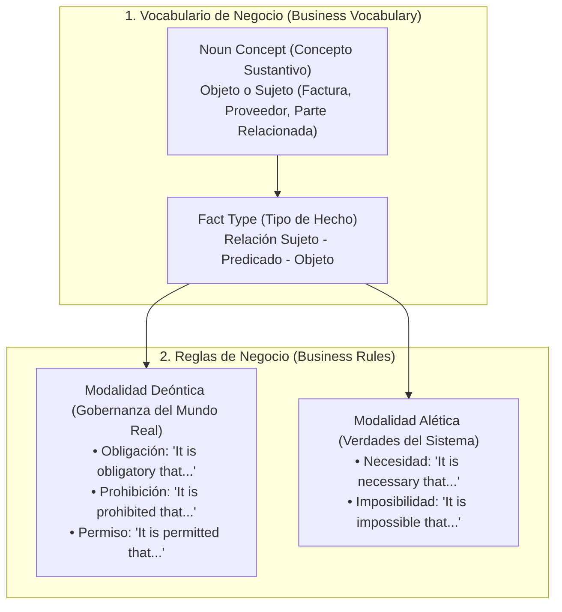

# Fundamentos de SBVR en la Arquitectura Accounting & Audit by Design (A&AD)

**Autor:** Richard Gasca (`co.auditoria@pm.me`)  
**Estándar:** OMG Semantics of Business Vocabulary and Business Rules (SBVR 1.5)  
**Ubicación:** `Shift Left/SBVR/sbvr_fundamentos_arquitectura_aad.md`

---

## 1. El Problema Raíz que Resuelve SBVR

En las organizaciones tradicionales existe una brecha histórica conocida como la **"Torre de Babel de la Lógica de Negocio"**:

* **El Abogado / Regulador / Contador:** Redacta reglas e intenciones en lenguaje natural humano (en contratos, estatutos, NIIF o normas de la DIAN). El lenguaje humano es intrínsecamente flexible y a menudo ambiguo.
* **El Arquitecto de Software / Programador:** Intenta traducir esas normas a código (Java, C#, Python, SQL). Durante esta traducción, el programador malinterpreta la regla o la oculta (*hardcodea*) dentro de miles de líneas de código fuente.
* **El Auditor / Revisor:** No puede verificar si el sistema informático realmente cumple la norma jurídica o contable sin depender de inspecciones manuales o "cajas negras".

**SBVR elimina esta brecha.** Define un lenguaje intermedio: un **Lenguaje Natural Controlado (CNL)** que es 100% legible para los humanos (abogados, contadores) y 100% interpretable matemáticamente por las computadoras.

---

## 2. Los Dos Cimientos de SBVR

SBVR no es una simple lista de validaciones; se basa en dos estructuras semánticas rigurosas:

---

## 3. Ejemplo Práctico: De SBVR a la Validación Ejecutable

Supongamos una regla de control para operaciones con partes relacionadas (NIC 24):

### Paso 1: En SBVR (Structured English / Lenguaje Controlado)
> *"It is obligatory that each Factura that is issued by a Proveedor where that Proveedor is a Parte Relacionada includes an explicit Aprobación de Junta Directiva."*

### Paso 2: La Transformación Semántica (Mapeo a XBRL GL y JSON-LD)
Esta frase en SBVR no se queda en papel. Mediante herramientas de mapeo (como **Altova MapForce**):
* **Factura** se mapea al nodo `gl-cor:entryHeader` / `ubl:Invoice`.
* **Proveedor** se mapea a `gl-cor:identifierReference` / `iso15944:Agent`.
* **Parte Relacionada** se mapea a un concepto de clasificación taxonomizado en SKOS.
* La **Obligación Deóntica** (*"It is obligatory that..."*) se compila automáticamente en un archivo de restricciones **W3C SHACL 1.2** (Shapes Constraint Language).

### Paso 3: Ejecución Determinista (Poka-Yoke)
Cuando el documento o transacción intenta ingresar como un Holón (Vault-LD) a la base de datos bitemporal (**TerminusDB**), el motor SHACL evalúa la forma del subgrafo:
* Si la transacción incluye el token de Aprobación de Junta Directiva, pasa y se ancla criptográficamente.
* Si no lo incluye, es rechazada en la puerta de entrada (**Shift Left**), garantizando cero inconsistencias en la bóveda de auditoría.

---

## 4. ¿Por qué es un Estándar de Vanguardia?

1. **Declarativo, no Imperativo:** Las reglas no se programan con algoritmos paso a paso (*"haga esto, luego aquello"*); se declaran como restricciones sobre la verdad del dato.
2. **Independiente de la Tecnología:** Si mañana cambias la base de datos de TerminusDB a otro motor, la regla SBVR sigue siendo exactamente la misma.
3. **Superficie de Interacción para IA y LLMs:** Los modelos de lenguaje (LLMs) entienden perfectamente el *Structured English* de SBVR. Al alimentar a un agente con reglas SBVR, la IA comprende las limitaciones jurídicas y contables **sin alucinar**.

---

## 5. Resumen para la Arquitectura Accounting & Audit by Design (A&AD)

En la arquitectura **A&AD**:

* **UBL** pone el contrato de intercambio comercial (B2B/B2G).
* **ISO 15944 (REA)** pone la causalidad económica (Agentes, Recursos, Eventos, Dualidad).
* **XBRL GL + SRCD** pone la estructura contable multidimensional.
* **SBVR** es el **Gobernador Deóntico Transversal**: la mente formal que expresa las reglas de negocio de forma clara para los humanos y compilable (vía SHACL) para el motor determinista de grafos.
