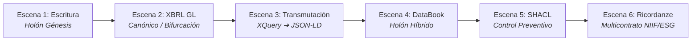

# Guión Técnico y Narrativo de Video: El Flujo A&AD
## *De la Escritura Pública al Grafo de Conocimiento Semántico*

---

## 🎬 Ficha Técnica del Video
* **Título**: De la Escritura Pública al Grafo Semántico: El Flujo Industrializado de Accounting and Audit by Design (A&AD).
* **Objetivo**: Explicar de forma pedagógica y visual el ciclo de vida completo de un hecho de negocio: desde su origen legal como Holón, pasando por el canónico XBRL GL, hasta la transmutación a JSON-LD, la empaquetación en DataBooks y el control preventivo con SHACL.
* **Tono**: Profesional, disruptivo, técnico-contable y vanguardista.

---

## 📐 Estructura por Escenas



---

### 🎥 Escena 1: El Origen - Reificación del Contrato de Constitución (Momento 0)

* **Visual en Pantalla**: 
  * Imagen/PDF de la Escritura Pública de Constitución (`SOCIEDAD_LIMITADA.pdf`).
  * Resaltado dinámico de las cláusulas: Socios, Aportes de Capital ($10,000,000 COP) y Nombre de la entidad.
  * Captura de pantalla de la interfaz **XForms + IA Generativa** extrayendo los componentes **REA** (*Resource, Event, Agent*).
* **Voz en Off / Locución**:
  > *"Todo proceso contable nace de una realidad jurídica. En el modelo tradicional, una Escritura de Constitución se convierte en un PDF estático en una carpeta y en un par de números planos digitados manualmente en un ERP.*
  > 
  > *En el marco **Accounting and Audit by Design (A&AD)**, la Escritura de Constitución es nuestro **Holón Génesis** (Momento 0). Mediante una interfaz inteligente en XForms apoyada por Inteligencia Artificial, reificamos el contrato extrayendo de forma determinista sus Recursos económicos, sus Agentes firmantes y los Compromisos adquiridos."*

---

### 🎥 Escena 2: El Canónico XBRL GL - La "Aduana" Universal y la Doble Bifurcación

* **Visual en Pantalla**:
  * Diagrama de flujo mostrando la exportación hacia la estructura XML de **XBRL Global Ledger (XBRL GL)**.
  * Animación de una bifurcación con dos caminos:
    * **Camino A (Lado Izquierdo)**: Flechas hacia bases de datos relacionales SQL (SAP, Siesa, PostgreSQL).
    * **Camino B (Lado Derecho)**: Flechas hacia el motor semántico XQuery 3.1.
* **Voz en Off / Locución**:
  > *"Aquí llegamos a un principio arquitectónico innegociable: **Todo Holón debe ser procesado primeramente en XBRL GL**. XBRL GL actúa como nuestra aduana de estandarización universal e independiente de plataforma. Preserva la fidelidad de los asientos, los participantes y las notas legales.*
  > 
  > *A partir de este punto canónico en XBRL GL se abre una **doble posibilidad**:
  > 1. **Para sistemas legacy**: Podemos alimentar directamente tablas relacionales SQL en ERPs tradicionales como Siesa o SAP sin perder la trazabilidad de origen.
  > 2. **Para el paradigma A&AD**: Transmutamos de forma limpia el XML hacia un Grafo de Conocimiento Semántico."*

---

### 🎥 Escena 3: La Transmutación a JSON-LD vía XQuery 3.1

* **Visual en Pantalla**:
  * Código XQuery 3.1 ejecutándose (`xbrlgl2jsonld.xq`).
  * Estructura del Payload JSON-LD resultante (`xbrlgl2jsonld.json`) destacando el `@context` y el `@graph`.
  * Grafos visuales mostrando la deduplicación de nodos: `AccountingEntry`, `Account`, `Entity` y `TaxonomyConcept`.
* **Voz en Off / Locución**:
  > *"Mediante un motor declarativo XQuery 3.1, transmutamos la instancia XBRL GL en un **Payload JSON-LD**. 
  > 
  > *En este paso no solo convertimos texto en código: reificamos y deduplicamos las entidades. Cada cuenta contable, cada socio fundador y cada concepto de reporte NIIF o fiscal adquiere una URI única e inmutable. Las transacciones dejan de ser registros aislados para convertirse en un grafo plano e interconectado de conocimiento."*

---

### 🎥 Escena 4: El DataBook - El Envoltorio Vivo para Humanos e Inteligencia Artificial

* **Visual en Pantalla**:
  * Apertura del archivo `output.databook.md`.
  * Desplazamiento visual: arriba se observa el texto legal legible en Markdown; abajo se despliega el bloque ` ```json-ld ` incrustado.
  * Demostración en Google Colab/Python ejecutando consultas SPARQL en memoria de forma offline.
* **Voz en Off / Locución**:
  > *"El Payload JSON-LD se incrusta junto con la narrativa del contrato en un **DataBook** (`.databook.md`), el envoltorio ideado por Kurt Cagle.
  > 
  > *El DataBook es un **Holón autocontenido con naturaleza dual**: el ser humano o el juez lee la narrativa en texto plano, mientras que los motores de grafo y los agentes de IA leen el JSON-LD incrustado. Esto permite ejecutar auditorías externas deterministas offline con SPARQL, sin necesidad de conectarse a la base de datos de origen y eliminando el riesgo de alucinaciones en la IA."*

---

### 🎥 Escena 5: Control Interno Preventivo con SHACL (Shapes Guard)

* **Visual en Pantalla**:
  * Código de reglas Turtle SHACL (`entry_shape.ttl` o `balance_shape.ttl`).
  * Simulación visual de un intento de ingreso de un asiento desbalanceado o con acciones embargadas $\rightarrow$ Icono de **RECHAZADO EN TIEMPO REAL**.
* **Voz en Off / Locución**:
  > *"¿Dónde está el control interno? Aquí entra **SHACL (Shapes Constraint Language)**. SHACL actúa como una puerta de guardia en el momento de la ingesta.
  > 
  > *En lugar de hacer auditorías forenses al final del mes en hojas de cálculo, SHACL evalúa el Grafo en tiempo real. Si un asiento está desbalanceado o si intenta venderse una acción que tiene un embargo judicial registrado, SHACL rechaza la transacción en la puerta de entrada. **En A&AD, todo se controla desde el principio.**"*

---

### 🎥 Escena 6: Evolución Multicontrato - El Ricordanze Moderno y Reportes NIIF / ESG

* **Visual en Pantalla**:
  * Animación de múltiples contratos ingresando al Grafo (Facturas UBL de agua en $m^3$, métricas XBRL UTR, acuerdos financieros ACTUS, medidas cautelares).
  * El Grafo en DFRNT / TerminusDB creciendo de forma inmutable (**Append-Only / PROV-O**).
  * Dashboard final mostrando la derivación en tiempo real del **Estado de Situación Financiera (NIIF)** y el **Reporte de Huella Hídrica / Sostenibilidad (ESG/GRI 303)**.
* **Voz en Off / Locución**:
  > *"A partir del Momento 0, la empresa vive y celebra múltiples contratos. Siguiendo la visión de Charles Hoffman, el Grafo de Conocimiento se convierte en el **Ricordanze Moderno**: un registro de memoria empresarial inmutable y bitemporal.
  > 
  > *Desde esta misma **Fuente Única de Verdad**, podemos consultar en tiempo real los Estados Financieros bajo NIIF y, simultáneamente, los reportes de sostenibilidad ESG con métricas físicas estandarizadas por el Registro UTR de XBRL International. 
  > 
  > *Esto es **Accounting and Audit by Design**: el fin del control reactivo y el inicio de la certeza algorítmica."*

---

## 📌 Consejos de Edición para el Video
1. **Tomas de Código**: Destacar con luces/zoom de cámara los bloques ` ```json-ld ` en el DataBook y el script `xbrlgl2jsonld.xq`.
2. **Diagramas**: Usar animaciones vectoriales limpias (estilo la interfaz de DFRNT y el Atlas de Zachman).
3. **Música de Fondo**: Estilo corporativo/tecnológico sobrio y moderno (estilo ciencia de datos/blockchain).
