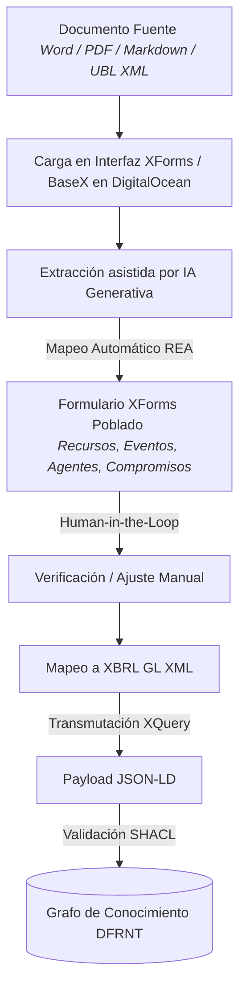
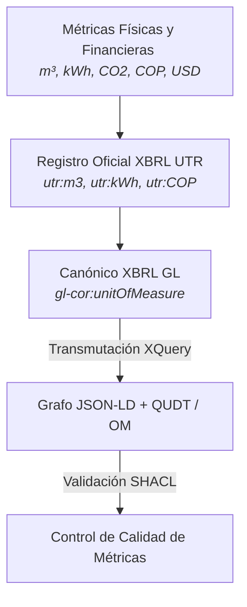

# Transmutación Semántica: De XBRL GL a Grafo de Conocimiento JSON-LD

## 1. Resumen Ejecutivo

En esta etapa del pipeline de **Accounting and Audit by Design (A&AD)**, se ha implementado y ejecutado la transmutación declarativa mediante **XQuery 3.1** para transformar instancias de libro mayor estandarizadas en **XBRL GL (XML)** hacia un **Grafo de Conocimiento Semántico completo en formato JSON-LD**.

En la arquitectura A&AD, **cada hecho de negocio o contrato (como la Escritura de Constitución de una entidad) constituye un Holón autónomo**. Para preservar la interoperabilidad y la cadena de custodia semántica, **todo Holón debe ser procesado obligatoriamente en XBRL GL** antes de su transmutación hacia el Grafo de Conocimiento en JSON-LD y su posterior ingesta en **DFRNT / TerminusDB** o incrustación en **DataBooks**.

---

## 2. El Concepto del Holón y el Canónico XBRL GL

Un **Holón** (concepto ontológico de Arthur Koestler y Shyam Sunder) es una estructura autónoma e inmutable que actúa como un todo autosuficiente y, al mismo tiempo, como una parte integrada del grafo empresarial:

1. **El Holón de Origen (Escritura de Constitución)**:
   * Representa el acuerdo de voluntades, la norma jurídica primaria y el inicio del patrimonio (**Momento 0**).
2. **El Procesamiento en XBRL GL (Canónico Universal)**:
   * Todo Holón se traduce primeramente al estándar **XBRL GL (Global Ledger)**. XBRL GL actúa como la "aduana" de estandarización universal, empaquetando asientos (`gl-cor:entryDetail`), participantes (`gl-cor:identifierReference`), cuentas (`gl-cor:account`) y referencias al documento legal fuente (`gl-bus:documentInfo`).
3. **El Payload JSON-LD Resultante**:
   * Es la transmutación del Holón XBRL GL a un formato computable de grafo plano e interconectado ([xbrlgl2jsonld.json](file:///C:/Users/IPHIX/Documents/Projects/DFRNT/Taller1_EventsLedger/Ejemplo%20XBRLGL/Xquery/xbrlgl2jsonld.json)).

---

## 3. Estructura del Payload JSON-LD

El **Payload JSON-LD** se compone de dos secciones fundamentales:

1. **Contexto Ontológico (`@context`)**:
   * Define los vocabularios globales (**W3C XSD**, **RDFS**, **SKOS**, **REA**, **PROV-O**, **XBRL GL**, **XBRL UTR**, ontología **DFRNT**).
   * Mapea identificadores de propiedades (`hasAccount`, `hasEntity`, `classifiedUnder`, `amount`, `debitCreditCode`, `postingDate`, `unitOfMeasure`) a URIs y tipos de datos estrictos (ej. `xsd:decimal`).

2. **Grafo de Nodos Reificados (`@graph`)**:
   * Conjunto unificado de nodos interconectados mediante URIs deterministas (`urn:...`), eliminando la duplicidad y estableciendo relaciones semánticas explícitas.

---

## 4. Reificación y Modelado de Nodos del Holón

Durante la transmutación del Holón en XBRL GL, el motor procesa y reifica cuatro clases de nodos:

### A. Nodos de Conceptos Taxonómicos (`TaxonomyConcept`)
* **URI**: `urn:taxonomy:<Concepto_Normalizado>`
* **Propósito**: Deduplica y reifica los conceptos de reporte de la taxonomía XBRL SRCD (`gl-srcd:detailedContentFilter`). Permite clasificar las cláusulas y transacciones del Holón según estándares como IFRS, US GAAP o impuestos.

### B. Nodos de Cuentas Contables (`Account`)
* **URI**: `urn:account:<accountMainID>`
* **Propósito**: Extrae y deduplica el plan de cuentas (`gl-cor:accountMainID` y `gl-cor:accountMainDescription`), independizando la definición de la cuenta de sus movimientos individuales.

### C. Nodos de Entidades y Terceros (`Entity`)
* **URI**: `urn:entity:<identifierCode>`
* **Propósito**: Reifica los participantes del Holón (socios fundadores, terceros, fondos o centros de responsabilidad) desde `gl-bus:identifierCode`.

### D. Nodos de Asientos Contables (`AccountingEntry`)
* **URI**: `urn:entry:<posición>:<accountMainID>`
* **Propósito**: Representa cada detalle de movimiento contable atómico del Holón (`gl-cor:entryDetail`), conteniendo:
  * Importe (`amount`) codificado con precisión decimal (`xsd:decimal`).
  * Indicador Débito/Crédito (`debitCreditCode`).
  * Período o fecha de contabilización (`postingDate`).
  * **Aristas de Enlace**:
    * `hasAccount` $\rightarrow$ Enlace al nodo `Account` correspondiente.
    * `hasEntity` $\rightarrow$ Enlace al nodo `Entity` (tercero/socio).
    * `classifiedUnder` $\rightarrow$ Colección de enlaces hacia los nodos `TaxonomyConcept`.

---

## 5. Ejemplo Representativo del Payload JSON-LD

```json
{
  "@context": {
    "xsd": "http://www.w3.org/2001/XMLSchema#",
    "rdfs": "http://www.w3.org/2000/01/rdf-schema#",
    "skos": "http://www.w3.org/2004/02/skos/core#",
    "rea": "http://purl.org/rea#",
    "prov": "http://www.w3.org/ns/prov#",
    "utr": "http://www.xbrl.org/2009/utr#",
    "gl-cor": "http://www.xbrl.org/int/gl/cor/2015-03-25/",
    "dfrnt": "http://dfrnt.com/schema/audit#",
    "AccountingEntry": "dfrnt:AccountingEntry",
    "Account": "dfrnt:Account",
    "Entity": "dfrnt:Entity",
    "TaxonomyConcept": "dfrnt:TaxonomyConcept",
    "hasAccount": { "@id": "dfrnt:hasAccount", "@type": "@id" },
    "hasEntity": { "@id": "dfrnt:hasEntity", "@type": "@id" },
    "classifiedUnder": { "@id": "dfrnt:classifiedUnder", "@type": "@id", "@container": "@set" },
    "amount": { "@id": "gl-cor:amount", "@type": "xsd:decimal" }
  },
  "@graph": [
    {
      "@type": "Account",
      "@id": "urn:account:110505",
      "accountMainID": "110505",
      "accountMainDescription": "Caja General"
    },
    {
      "@type": "Entity",
      "@id": "urn:entity:900123456",
      "identifierCode": "900123456",
      "identifierDescription": "Socio Fundador A"
    },
    {
      "@type": "AccountingEntry",
      "@id": "urn:entry:1:110505",
      "entriesType": "trialbalance",
      "hasAccount": "urn:account:110505",
      "hasEntity": "urn:entity:900123456",
      "amount": "10000000.00",
      "debitCreditCode": "D",
      "postingDate": "2025-07-31",
      "classifiedUnder": [
        "urn:taxonomy:CapitalSocial"
      ]
    }
  ]
}
```

---

## 6. Integración con SKOS (*Simple Knowledge Organization System*)

Para garantizar la explicabilidad y el control determinista sobre agentes de Inteligencia Artificial (IA Generativa), la taxonomía de conceptos del Holón (`TaxonomyConcept`) y los planes de cuentas se alinean con el estándar del W3C **SKOS**.

* **`skos:Concept`**: Define cada concepto contable o regulatorio del Holón como una entidad independiente.
* **`skos:prefLabel` / `skos:altLabel`**: Etiqueta nombres oficiales y sinónimos multilingües (ej. `"Caja General"`@es, `"110505"`).
* **`skos:broader` / `skos:narrower`**: Establece jerarquías explícitas entre conceptos (ej. relacionar *Caja General* como hijo de *Efectivo y Equivalentes*).
* **Arquitectura Neurosimbólica**: El LLM opera en la **capa neuronal** (lenguaje natural), mientras que SKOS actúa en la **capa simbólica** (delimitando las reglas del Holón con certeza lógica, evitando alucinaciones).

---

## 7. Fundamentos Ontológicos: REA y PROV-O

Para sostener la representación semántica de los contratos y su trazabilidad inmutable, la arquitectura A&AD integra las ontologías fundamentales **REA** y **PROV-O**:

### A. Ontología REA (*Resource-Event-Agent*)
* **`rea:Resource`**: Define los recursos económicos objeto del contrato (Efectivo, Inventario, Capital Social, Acciones, Agua/Energía).
* **`rea:EconomicEvent` / `rea:Commitment`**: Representa el hecho económico o contrato (el Holón) que crea, modifica o extingue obligaciones y derechos.
* **`rea:Agent`**: Modela a los participantes (socios, proveedores, clientes, juzgados, empresas de servicios públicos).
* **Dualidad REA (`rea:duality`)**: Modela el intercambio económico dual de forma inherente (entrada/salida de recursos).

### B. Ontología PROV-O (*W3C Provenance Ontology*)
* **`prov:Entity`**: Modela el estado inmutable de los datos y documentos del contrato en cada instante del tiempo.
* **`prov:Activity`**: Modela la actividad de transmutación y procesamiento (ej. ejecución del script de XQuery o generación del DataBook).
* **`prov:Agent`**: Identifica el motor o actor (ej. sistema, validador SHACL, notaría, juzgado) que generó o atribuyó el dato.
* **`prov:wasDerivedFrom` / `prov:wasGeneratedBy`**: Proporcionan la **cadena de custodia bitemporal**. Garantiza que cualquier saldo contable pueda rastrearse hasta su contrato fuente y su sello temporal exacto.

---

## 8. El Grafo como el "Ricordanze Moderno" (Evolución Multicontrato)

Basado en la visión de Charles Hoffman (*Modern Version of Ricordanze*):

1. **Evolución Continua del Grafo**:
   * Tras la Escritura de Constitución (**Momento 0**), la entidad celebra múltiples contratos (ventas, compras UBL, préstamos ACTUS, acuerdos laborales, medidas cautelares judiciales, consumo de servicios).
   * Cada contrato entra al sistema como un **nuevo Holón**, se estandariza en **XBRL GL**, se transmuta a **JSON-LD** y actualiza el Grafo de Conocimiento en **DFRNT / TerminusDB**.
2. **Inmutabilidad y Bitemporalidad**:
   * Gracias al almacenamiento **apilar-solo (Append-Only)** de TerminusDB y las propiedades de **PROV-O**, la incorporación de nuevos contratos acumula la historia sin sobreescribir el pasado.
3. **Reportes Derivados en Tiempo Real**:
   * Los Estados Financieros (Balance General, Flujo de Efectivo, NIIF, ESG) se calculan dinámicamente mediante **consultas SPARQL / QOWL** sobre la colección viva de Holones del *Ricordanze Digital*.

---

## 9. Arquitectura de Ingesta Inteligente (XForms + IA + BaseX + XBRL GL)

Para materializar la captura de contratos en la práctica operativa, se define la siguiente arquitectura de ingesta híbrida (Humano + IA):



---

## 10. Estudio de Caso: Embargo Judicial de Acciones

Para ilustrar el poder del pipeline frente a eventos legales complejos, considere el caso en que un **Juzgado emite una Medida Cautelar de Embargo sobre las acciones de un accionista**:

1. **Documento Fuente**: PDF del Oficio del Juzgado (Medida Cautelar).
2. **Ingesta XForms + IA**:
   * **`rea:Agent`**: Juzgado Promiscuo (Autoridad Judicial) y Socio Accionista Afectado.
   * **`rea:Resource`**: Acciones ordinarias de la sociedad (`FIBO_Share`).
   * **`rea:EconomicEvent`**: Gravamen / Embargo Judicial (`dfrnt:LegalEncumbrance`).
3. **Estandarización XBRL GL XML**:
   * Se registra el hecho con `gl-cor:entriesType` = `"legal_restriction"`.
   * Se asigna `gl-cor:measurableQuantity` = Número de acciones embargadas.
4. **Transmutación a JSON-LD**:
   * El grafo actualiza la relación del nodo `Entity` del accionista afectando la disponibilidad de sus acciones con un tag `dfrnt:hasEncumbrance`.
5. **Protección SHACL (Control Interno Activo)**:
   * Si en el futuro se intenta registrar una transacción de venta o traspaso de esas acciones embargadas, **SHACL rechaza automáticamente el asiento**, impidiendo operaciones ilegales en tiempo real.

---

## 11. Estudio de Caso: Control Ambiental Ex-Ante y Ex-Post en Contratos

Una de las contribuciones clave de A&AD es la gestión de **impactos ambientales esperados vs. ejecutados** a lo largo de la vida del contrato:

1. **Definición Ex-Ante del Compromiso (`rea:Commitment`)**:
   * Al redactarse el contrato, el formulario XForms captura las cláusulas ambientales y registra en el grafo un nodo `rea:Commitment` de tipo ambiental (ej. *"Límite máximo permitido: 1,000 m³ de agua y 50 toneladas de CO2 para la ejecución de la obra"*).
2. **Registro Ex-Post de Consumos Reales (`rea:EconomicEvent`)**:
   * Cada factura electrónica (UBL XML de acueducto/energía) o reporte de medidor ingresa al sistema registrando nodos `rea:EconomicEvent` asociados al contrato mediante `rea:fulfillsCommitment` / `prov:wasDerivedFrom`.
3. **Control SHACL en Tiempo Real**:
   * El motor **SHACL** evalúa en cada transacción la suma acumulada de los eventos reales frente al límite del compromiso:
     $$\sum \text{Consumo Real (Eventos)} \le \text{Límite Ambiental Permitido (Compromiso)}$$
   * Si la suma acumulada excede la meta pactada en el contrato, **SHACL bloquea el procesamiento del siguiente pago o facturación**, exigiendo mitigación ambiental previa.

---

## 12. Incorporación de las Métricas Estándar XBRL UTR (*Unit Taxonomy Registry*)

Para evitar la fragmentación de métricas (donde un sistema registra `"m3"`, otro `"metros3"` y otro `"MTQ"`), el stack A&AD integra formalmente el **XBRL UTR (Unit Taxonomy Registry)** ([xbrl.org/utr](https://www.xbrl.org/utr/utr.html)), el catálogo internacional estandarizado de unidades de medida mantenido por XBRL International.



### Integración Técnica de UTR en el Stack:
1. **Capa XBRL GL (Origen)**:
   * Los valores físicos y financieros se vinculan a las URIs oficiales del UTR:
     * `gl-cor:unitOfMeasure`: `"http://www.xbrl.org/2009/utr#m3"` (Metros Cúbicos).
     * `gl-cor:unitOfMeasure`: `"http://www.xbrl.org/2009/utr#kWh"` (Kilovatios hora).
     * `gl-cor:unitOfMeasure`: `"http://www.xbrl.org/2009/utr#COP"` (Pesos Colombianos).
2. **Capa JSON-LD / Grafo Semántico**:
   * En el contexto `@context`, el espacio de nombres `utr` se mapea a `http://www.xbrl.org/2009/utr#` y se alinea con ontologías de dimensión física como **QUDT** (*Quantities, Units, Dimensions and Data Types*).
   * Esto permite que agentes de IA o consultas SPARQL realicen **conversiones automáticas deterministas** (ej. transformar $1 \text{ m}^3 = 1,000 \text{ Litros}$).
3. **Validación Preventiva SHACL de Métricas**:
   * Una regla SHACL en el *Shapes Graph* exige que todo dato no financiero o de sostenibilidad utilice obligatoriamente una URI válida registrada en el UTR de XBRL International, impidiendo la ingesta de unidades ambiguas o informales.

---

## 13. Conclusión Magistral: Accounting and Audit by Design (Control en el Origen)

La esencia fundamental del paradigma **Accounting and Audit by Design (A&AD)** se resume en una máxima inquebrantable:

> **"Todo se controla desde el principio."**

### Comparativa de Paradigmas:

| Dimensión | Paradigma Tradicional (ERP SQL) | Paradigma A&AD (Grafo + SHACL + XBRL GL) |
| :--- | :--- | :--- |
| **Enfoque de Control** | **Reactivo / Forense**: Se corrigen errores y fraudes semanas o meses después. | **Preventivo / By Design**: Las reglas operan en el momento exacto en que nace el hecho (`Momento 0`). |
| **Integridad del Dato** | Depende de código procedimental duro en el software y validaciones manuales. | **Propiedad Topológica del Grafo**: SHACL impide físicamente guardar datos desbalanceados o ilegales. |
| **Unidades de Medida** | Texto libre fragmentado (`"m3"`, `"mt3"`, `"litros"`). | **Estandarización XBRL UTR**: Métricas globales verificables e interoperables ([xbrl.org/utr](https://www.xbrl.org/utr/utr.html)). |
| **Control Ambiental (ESG)** | Mediciones anuales desconectadas de la contabilidad diaria. | **Gobernanza Ex-Ante/Ex-Post**: `rea:Commitment` vs `rea:EconomicEvent` controlados continuamente por SHACL. |
| **Conciliaciones** | Deuda de conciliación permanente (cierre de mes en hojas de cálculo). | **Cero Conciliación**: El registro es autocontenido y autorreconciliable desde la ingesta. |
| **Auditoría con IA** | Modelos de IA analizan texto plano con riesgo de alucinación. | **Arquitectura Neurosimbólica**: El LLM se encuadra de forma determinista en taxonomías SKOS y grafos RDF. |
| **Alcance de Información** | Registros numéricos monetarios aislados. | **Fuente Única de Verdad**: Financiera (NIIF), Legal (Contratos/Embargos) y ESG ($m^3$, CO2) unificados. |
