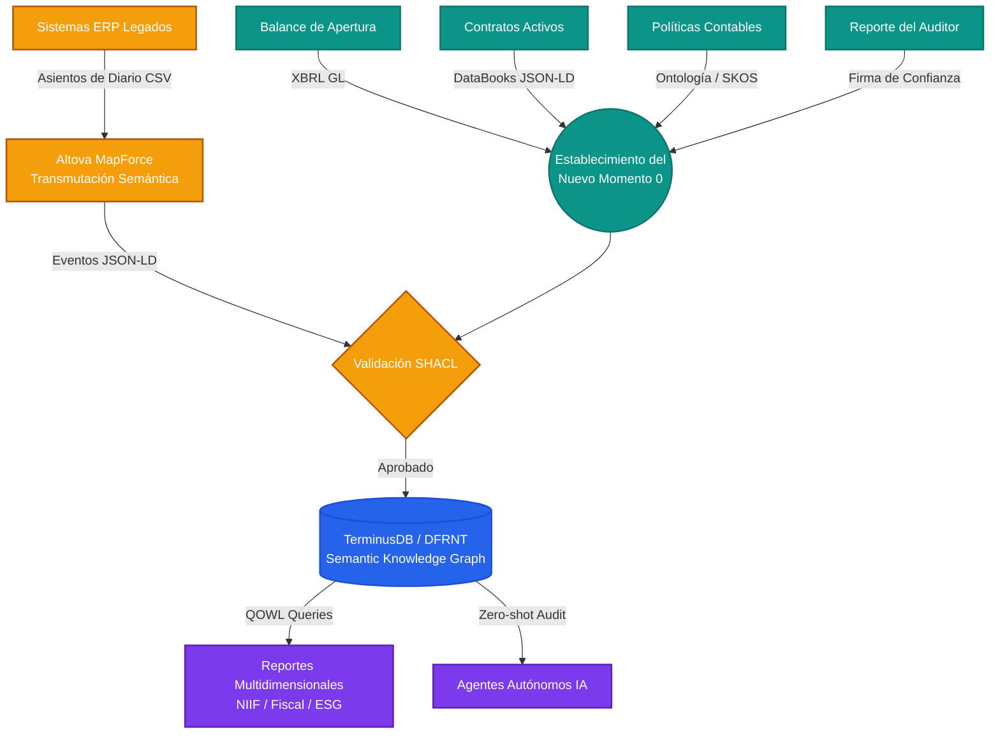

# A&AD Going Concern Onboarding Canvas

*Metodología de Implementación para Entidades en Marcha (SMEs & Firmas Tier 2)*

Para escalar el framework A&AD y competir en el espacio de las PyMEs, no podemos asumir que las empresas nacen desde cero. Debemos construir el Gemelo Digital Semántico de una entidad que ya existe (Going Concern). 

Este Canvas define la receta exacta para establecer un nuevo **"Momento 0"** artificial, anclarlo con certeza y poblar el grafo de conocimiento hasta el presente.

---

## 1. El Nuevo "Momento 0" (Génesis Operacional)
Para una entidad en marcha, el universo semántico comienza con una foto inmutable de su estado actual, no con su escritura de constitución original.

*   **Balance de Apertura (Opening Balance Sheet):** El saldo inicial estructurado (XBRL GL). Este es el *holón* fundacional del nuevo Gemelo Digital. Todos los eventos futuros se calculan matemáticamente a partir de este punto.

## 2. Contexto Semántico y Legal (La Realidad Subyacente)
Un saldo en el balance no significa nada sin los derechos, obligaciones y reglas que lo sustentan.

*   **Contratos Activos:** Digitalización y extracción (DataBooks) de todos los contratos vigentes a la fecha de apertura que afectan la información financiera (arrendamientos, deudas, compromisos de capital).
*   **Políticas Contables:** Las reglas de juego (US GAAP, IFRS, políticas internas) codificadas como restricciones formales en la ontología para gobernar el comportamiento futuro del grafo.

## 3. Anclaje de Confianza (Assurance Anchor)
El "Shift-Left" requiere que la información que entra al sistema ya esté validada.

*   **Reporte del Auditor (Auditor's Report):** El dictamen del auditor independiente sobre el Balance de Apertura. Este documento firma criptográficamente la validez del Momento 0, estableciendo la confianza base sin necesidad de revisar la historia anterior al ERP legado.

## 4. Hidratación Histórica (El Puente)
Una vez establecido y validado el Momento 0, se debe conectar con el presente.

*   **Asientos Contables del Sistema Legado (Legacy Journal Entries):** Extracción de los asientos de diario desde la fecha de apertura hasta el día actual. Estos se transmutan mediante Altova MapForce (o equivalentes) de su formato tabular (CSV/SQL) a JSON-LD.
*   *Nota técnica:* Esta ingesta masiva se somete a validación SHACL instantánea al entrar al grafo.

## 5. El Estado Destino (El Grafo Operativo)
El resultado final de la implementación.

*   **TerminusDB / DFRNT Instanciado:** La base de datos de grafo inmutable, hidratada con el Momento 0, el contexto legal, y la historia reciente.
*   **Capacidad QOWL:** La información financiera ahora puede ser consultada multidimensionalmente usando GraphQL sobre OWL, permitiendo reportes simultáneos (NIIF, Fiscal, ESG) y auditorías por agentes de IA.

---

### Diagrama de Flujo de Implementación (Pipeline)

