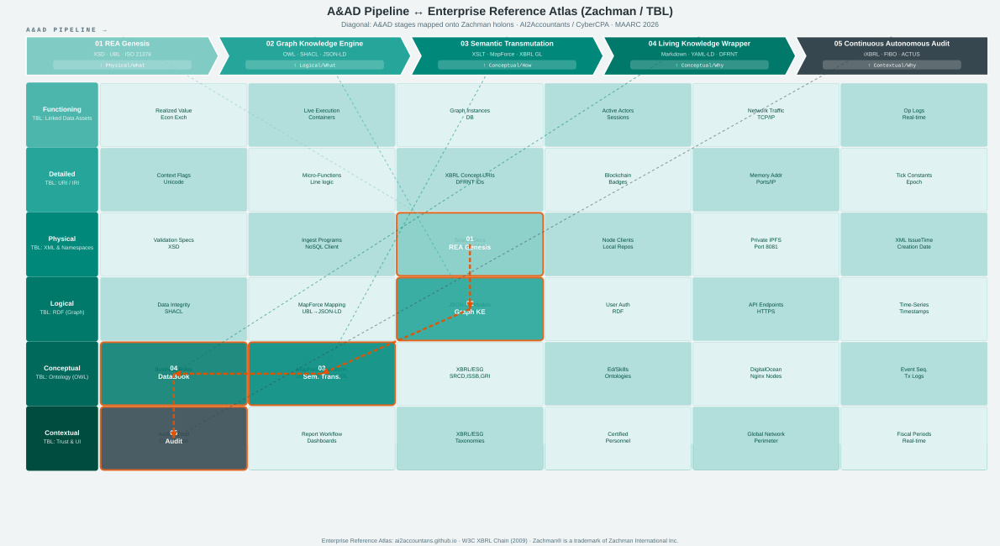

# Accounting & Audit by Design (AAbD) - Reference Atlas

Este diagrama presenta la arquitectura conceptual unificada, integrando el Framework de Zachman con las tecnologías fundacionales de la Web Semántica y XBRL GL.

---

### Recursos y Fundamentos Conceptuales
Los conceptos técnicos y de arquitectura empresarial ilustrados en este Atlas toman como base los siguientes estándares fundacionales:

* **The Zachman Enterprise Architecture Framework:**  
  [https://zachman-feac.com/](https://zachman-feac.com/)
* **XBRL eXtensible Business Reporting Language (W3C Report 2009):**  
  [https://www.w3.org/2009/03/xbrl/old-report.html](https://www.w3.org/2009/03/xbrl/old-report.html)
* **Semantic Web and Linked Data (Tim Berners-Lee, ISWC 2003):**  
  [https://www.w3.org/2003/Talks/1023-iswc-tbl/slide26-0.html](https://www.w3.org/2003/Talks/1023-iswc-tbl/slide26-0.html)
