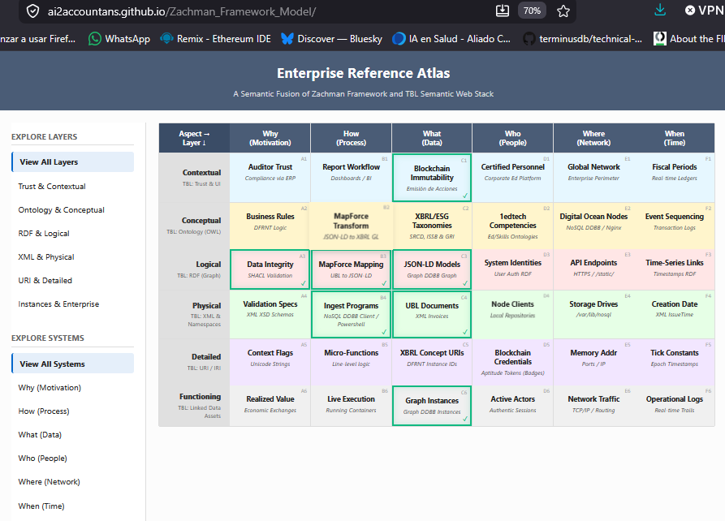
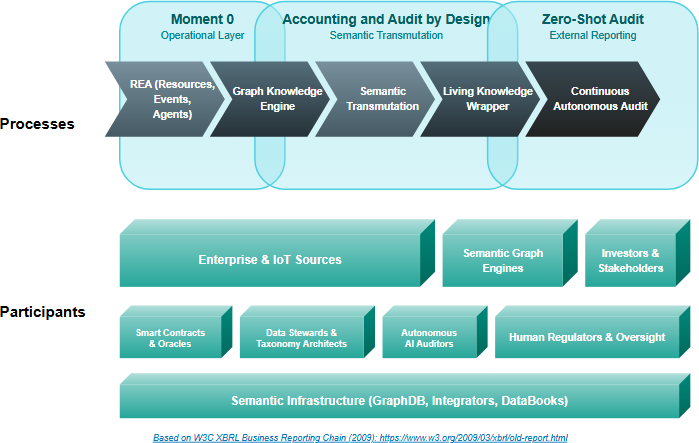

# El fin del control reactivo: Certeza algorítmica a través de la Contabilidad y Auditoría por Diseño (A&AD)

**Richard G. Gasca Buelvas**  
*profesor de cátedra del Departamento de Ciencias Contables de la Facultad de Ciencias Económicas y Administrativas de la Pontificia Universidad Javeriana*  
*Correo electrónico: rgasca@javeriana.edu.co*  

> **Nota de exención de responsabilidad (Disclaimer):** Las opiniones, análisis y conclusiones expresadas en este artículo son de exclusiva responsabilidad del autor y no comprometen ni representan la posición oficial de la Pontificia Universidad Javeriana.

**Resumen**

La profesión contable navega actualmente por un páramo de software caracterizado por una "jungla de aplicaciones" en constante expansión y una "maraña de integración" profundamente arraigada. A través del síndrome de la normalidad progresiva (*creeping normalcy*), los marcos de gobierno corporativo han tolerado una realidad fragmentada donde los registros financieros están desconectados de los eventos de negocio que los originaron. Esta fragmentación obliga a las organizaciones a depender de procesos de conciliación retroactivos y artesanales que son costosos, propensos a errores y limitan severamente la visibilidad disponible para las juntas directivas. Para escapar de este paradigma, la profesión debe industrializar sus procesos, pasando de una mentalidad artesanal —análoga a cocinar de memoria— a un enfoque industrializado que garantice resultados verificables.

Para resolver estas ineficiencias, este artículo introduce el marco de Contabilidad y Auditoría por Diseño (A&AD). El modelo A&AD reemplaza la verificación retrospectiva por un aseguramiento determinista en tiempo real, logrando un "Cumplimiento Defendible" (*Defensible Compliance*) en el momento exacto en que ocurren los eventos. Al extender el paradigma de desplazamiento hacia la izquierda (*shift-left*) al control organizacional, A&AD hace cumplir las restricciones fiscales y normativas directamente en el momento del origen económico: el contrato inicial o evento de negocio. Al representar las transacciones como holones autónomos e inmutables dentro de grafos de conocimiento semántico, aprovechando estándares W3C como JSON-LD y SHACL, el control interno deja de ser una intervención humana manual para convertirse en una propiedad topológica intrínseca de la arquitectura de datos. Este enfoque elimina sistemáticamente las conciliaciones posteriores, valida el cumplimiento regulatorio en el punto exacto de ingesta de datos y permite una auditoría continua sobre la totalidad de los eventos comerciales.

---

## 1. Introducción y la Deuda de Conciliación

Desde que se inventó la partida doble hace muchos siglos, la contabilidad siempre ha mirado por el espejo retrovisor. La tecnología moderna y los sistemas ERP a gran escala digitalizaron el proceso, pero simultáneamente crearon una "jungla de aplicaciones" de módulos desconectados. Hoy en día, los datos empresariales sufren de una fragmentación severa. Los registros financieros siguen siendo planos: fotos estáticas completamente desconectadas de los contratos legales y las operaciones reales que los generaron. A través de un proceso de "normalidad progresiva", la industria ha aceptado esta "maraña de integración" como práctica estándar, gastando fortunas y miles de horas en protocolos de conciliación artesanales solo para intentar unir un rompecabezas roto.

Para recuperar el control, las organizaciones deben alcanzar el **Cumplimiento Defendible** a través de la **Trazabilidad Epistémica**: una cadena inquebrantable y verificable de evidencia, lógica y estructura de datos que demuestre matemáticamente cómo una organización conoce su estado financiero. La justificación económica de esto se fundamenta en la **Regla 1-10-100 de Gestión de Calidad** (un principio central de Lean Six Sigma): invertir $1 en prevención en el punto de origen evita gastar $10 en remediación durante el cierre de mes, o $100 en fallas catastróficas de reporte.

Kendall Tieck (2014), en su presentación ante ISACA, conceptualizó esta necesidad como "Auditoría por Diseño: Más allá de la Auditoría Continua". Tieck argumentaba que el verdadero aseguramiento debe estar construido en el tejido del sistema en lugar de aplicarse retroactivamente. Sin embargo, la actual era de la inteligencia artificial agudiza los viejos problemas. Cuando agentes de software autónomos ejecutan procesos clave de negocio, los sistemas tradicionales registran el número final pero borran el contexto semántico, creando una caja negra.

¿Cómo recuperamos entonces el control? ¿Cómo volvemos a confiar en nuestros propios sistemas? La respuesta implica un cambio radical de metodología: en lugar de auditar al final del mes, vamos a validar los datos en el segundo exacto en el que se origina la transacción. A esto lo denominamos un gemelo digital semántico de Momento 0, desarrollado a través de la Investigación en Ciencia del Diseño (DSR). La arquitectura propuesta integra el framework de Recurso-Evento-Agente (REA) con los estándares de la Web Semántica, desacoplando el significado semántico de los eventos económicos (utilizando JSON-LD y XBRL GL) de las aplicaciones de software específicas.

Además, introducimos el uso de DataBooks híbridos (Cagle & Shannon, 2026) como mecanismo de transporte estandarizado. Al incrustar taxonomías SKOS (W3C, 2009b) directamente en los modelos de lenguaje grande (LLM), estos DataBooks permiten la auditoría inmediata y *zero-shot* de eventos de negocio, tanto por parte de supervisores humanos como de agentes de IA autónomos. La arquitectura resultante es la de una caja de cristal: toda la actividad económica es rastreable, verificable y auditable en tiempo real. El resto de este artículo describe los fundamentos teóricos de este modelo, detalla sus componentes de diseño y demuestra su aplicación práctica en la auditoría del Momento 0 de una entidad corporativa.

---

## 2. Trabajo Relacionado y Marco Teórico

La base teórica de la arquitectura A&AD se encuentra en la intersección de la Arquitectura Empresarial de Zachman, la pila de la Web Semántica de Tim Berners-Lee (Berners-Lee et al., 2001), los marcos contables ontológicos y las capacidades de auditoría de la inteligencia artificial generativa moderna. Esta integración aprovecha la clasificación estructurada de Zachman para mapear las interrogantes organizacionales (qué, cómo, dónde, quién, cuándo y por qué) directamente sobre las capas técnicas de la pila de la Web Semántica de Berners-Lee —la cual abarca desde la representación en RDF/OWL hasta las capas de reglas, pruebas criptográficas y confianza del sistema—, con el objetivo de sanar la división histórica que separa la lógica de negocio operativa de los registros de libros contables financieros.

### 2.1. El Paradigma REA y los Gemelos Digitales Basados en Grafos
La base conceptual de esta arquitectura se alinea con **Audit 4.0**, específicamente con el concepto de gemelo digital tipo **"Mundo Espejo"** (*Mirror World*) concebido por Dai & Vasarhelyi (2016). Un Mundo Espejo no es meramente un repositorio de datos, sino un reflejo activo y semántico de las interacciones económicas del mundo real. Cuando los analistas de Gartner comenzaron a describir los Gemelos Digitales de Organizaciones (DTOs), la misma lógica se traspuso a la gestión y las operaciones, posicionando a los DTOs como el tejido conectivo entre la actividad cotidiana y los reportes ejecutivos. Eso es útil. Pero no es suficiente. Un Gemelo Digital Semántico financiero no puede limitarse a reflejar flujos de trabajo o saldos contables —debe cargar el peso semántico completo de los eventos de negocio que produjeron esas cifras. Esa carga semántica es precisamente lo que habilita la Preparación para la IA (*AI Readiness*): sin ella, cualquier agente de IA que razone sobre datos financieros está, dicho sin rodeos, razonando sobre sombras. Este desplazamiento —de dato-como-resultado a dato-como-contexto— es lo que pioneros de la arquitectura empresarial como Dave McComb (2019) y Cheryl Dunn (2004) han descrito desde hace tiempo bajo la bandera de la arquitectura centrada en datos: un mundo donde el modelo de datos de la empresa sobrevive a todas las aplicaciones construidas sobre él. Para entender cómo construimos este gemelo, es necesario viajar en el tiempo, específicamente al año 1969. En ese año, George H. Sorter propuso algo revolucionario: un enfoque de eventos para la teoría contable. Sorter argumentaba que, en lugar de depender únicamente de resúmenes financieros tradicionales y superagregados, los sistemas debían registrar y recuperar datos detallados cada vez que ocurriera un evento económico individual. La idea era tan simple como poderosa: dar a los usuarios la información detallada para que ellos mismos tomaran las decisiones.

Años más tarde, en 1997, Shyam Sunder reforzó esta visión con su teoría de la contabilidad y el control, definiendo a la empresa como un nexo de contratos. Imagínelo así: una compañía no es más que una suma de acuerdos entre proveedores de recursos y personas que deciden darle origen a una entidad —nuestro Momento 0—, y el sistema contable debe estar ahí para medir y vigilar que estos acuerdos se cumplan. El framework A&AD operacionaliza este concepto llevando la idea de Sunder a la práctica: representamos cada contrato de forma independiente dentro de un grafo de conocimiento semántico. Cada contrato es un holón: un nodo autónomo con todos sus atributos. El resultado es la capacidad de rastrear en tiempo real cualquier transacción, evento o condición, así como la fuente y el uso de los recursos correspondientes.

¿Cómo estructuramos todo esto? Nos basamos en la teoría que William E. McCarthy (1982) formalizó: el modelo REA (Recurso-Evento-Agente). McCarthy sostenía que los registros contables deben reflejar la sustancia económica real de las transacciones, centrándose en la naturaleza del evento, las personas que participan y los recursos que se intercambian. Sin embargo, en aquellos tiempos y con la evolución de los sistemas ERP tradicionales, el concepto REA quedó atrapado dentro de las tablas relacionales. Con el tiempo, investigadores modernos han llevado el modelo a otro nivel, formalizándolo en ontologías rigurosas como OntoREA (Fischer-Pauzenberger & Schwaiger, 2017) para representar incluso los portafolios de derivados financieros más complejos (Fischer-Pauzenberger & Schwaiger, 2018).

Nuestro enfoque va un paso más allá: integramos directamente los estándares de la industria como FIBO (EDMC, 2020) y ACTUS (ACTUS Financial Research Foundation, 2018) en el grafo transaccional. Y aquí está la verdadera innovación topológica: no enrutamos las transacciones a través de un sistema relacional (ERP) para luego convertirlas en un grafo. Hacemos que el contrato nazca directamente en formato XBRL GL y, simultáneamente, que esa instancia sea transmutada en un payload JSON-LD para ser inyectado en el grafo semántico. El grafo es la fuente original de la verdad, y nuestra misión consiste en mantener hidratada esta ontología para que sea fuente de verdad para todos los propósitos —financieros y no financieros— de la entidad. Los sistemas tradicionales pueden ejecutarse en paralelo o sincronizarse en una segunda etapa, pero para manejar la complejidad multidimensional de los negocios de hoy, la dirección es clara: debemos evolucionar de los rígidos motores relacionales hacia la flexibilidad absoluta de los grafos semánticos.

### 2.2. El Método Seattle, Reglas Legibles por Máquina e Integración de la Cadena de Suministro
Históricamente ha existido un nudo entre las operaciones del día a día y los reportes externos. Este límite es precisamente lo que ataca el **Método Seattle** (Hoffman, 2025). Hoffman propone reemplazar los silos de datos cerrados por una Arquitectura Empresarial Impulsada por Modelos, en una transición de la contabilidad artesanal hacia la industrialización. El núcleo de este método reside en los **Organismos de Información Digital (DIO)** y en la generación de **Papeles de Trabajo Contables Canónicos (CAWP)**, transformando datos crudos de entrada en resultados estandarizados y comprobables.

De forma crucial, la autoverificación de estos registros no es una magia inherente del grafo en sí, sino el resultado de ejecutar **reglas legibles por máquina** —específicamente reglas de mecánica de revelación, reglas de eventos de negocio y mapeos transaccionales— aplicadas de manera determinista en el momento de la ingesta.

Y es aquí donde entra la estrella de este segmento: el lenguaje XBRL Global Ledger (XBRL GL). Para entender su valor, hagamos una distinción. Mientras el XBRL FR (Reportes Financieros) está diseñado para los reportes agregados al final del período, el XBRL GL captura y estandariza los datos transaccionales de la manera más granular posible. Dentro de este estándar, el elemento `accountingPurposeCode` resulta crucial: nos permite clasificar y etiquetar el propósito de cada registro contable desde el momento exacto en que nace el dato —si es para propósitos IFRS, US GAAP o fiscales, por ejemplo—. Al mapear esta etiqueta directamente al grafo semántico, resolvemos de un plumazo el clásico problema de tener múltiples libros contables paralelos. Un mismo evento transaccional puede ahora ser consultado y filtrado dinámicamente según el propósito requerido, asegurando granularidad total y eliminando la duplicidad. Es más, los registros resultantes son capaces de autoreconciliarse.

Implementar XBRL GL como corazón de nuestros datos permite una interoperabilidad total, independiente de la plataforma. El marco A&AD va más allá: extiende ese poder a través de toda la cadena de suministro, capturando tanto datos financieros cuantitativos como datos operativos no financieros. Al preservar estas ricas referencias contextuales a lo largo de toda la cadena de suministro de información —desde el evento de negocio original directamente hasta el libro mayor de reportes— el Gemelo Digital Semántico elimina inherentemente el esfuerzo tradicional y laborioso de reensamblar la traza de auditoría bajo demanda. Gracias a esta consolidación en el grafo semántico, podemos generar directamente un estado de situación financiera y, al mismo tiempo, un reporte de sostenibilidad corporativa —los conocidos reportes ESG— todo desde la misma fuente de verdad, sin extracciones engorrosas o remapeos adicionales. Para gobernar este flujo multidimensional, el framework se apoya en la Arquitectura Empresarial de Zachman, utilizando sus filas y columnas para mapear cada acción operativa directamente sobre las capas técnicas de la pila semántica.

### 2.3. IA Explicable, Estructuración SKOS y DataBooks
A medida que los modelos de aprendizaje automático asumen más responsabilidades en la auditoría financiera, surge el elefante en la habitación: el riesgo de las alucinaciones de la inteligencia artificial. Mitigar este riesgo no es solo importante, es primordial; necesitamos inteligencia artificial explicable.

Para lograrlo, el framework articula dos herramientas complementarias: los DataBooks de Cagle y Shannon (2026) y los SKOS. Los DataBooks son archivos Markdown híbridos que contienen cargas útiles JSON-LD incrustadas, perfectamente legibles por máquina. Lo que hacen estos DataBooks es la magia técnica del framework: conectan de manera efectiva los textos narrativos puros —los acuerdos legales, las escrituras de constitución— directamente con los datos estructurados en los grafos semánticos.

Los SKOS actúan como una capa auxiliar que complementa el esquema JSON-LD: organizan conceptos, etiquetas y relaciones semánticas en un vocabulario controlado, más claro e interoperable. Esta capa es especialmente valiosa cuando se desea enlazar la ontología con estándares externos, como FIBO o los estándares de 1EdTech para la certificación de competencias del personal. Con esto, logramos incorporar las taxonomías SKOS del W3C (2009b) directamente en la arquitectura de los grandes modelos de lenguaje (LLM): la base definitiva para una IA explicable.

¿Qué se hace hoy sin esta arquitectura? Se intenta cargar reglas regulatorias supercomplejas y de múltiples volúmenes —como las NIIF o los US GAAP— directamente en la ventana de contexto temporal del LLM. Esto es computacionalmente ineficiente y, francamente, dispara las tasas de error. En cambio, con nuestra arquitectura, el agente auditor de IA aprovecha el conocimiento preexistente del modelo sobre estas estructuras SKOS estandarizadas. El DataBook individual solo necesita exponerle los conceptos específicos y localizados relevantes para esa transacción en particular. Esta combinación permite a los agentes de auditoría evaluar grafos complejos con precisión milimétrica, siempre delimitados por fronteras ontológicas claras, facilitando así un monitoreo continuo, independiente y en el que se puede confiar plenamente.

## 3. Diseño del Artefacto: El Gemelo Digital Semántico A&AD

Siguiendo el enfoque de la investigación en ciencia del diseño (DSR, por sus siglas en inglés), esta propuesta se materializa en un artefacto orientado a integrar, estructurar y hacer trazable la información a lo largo de todo el proceso, desde su captura hasta su reporte. Su finalidad es conectar de manera consistente el entorno operativo con las exigencias normativas mediante una arquitectura que combina una base y cuatro componentes funcionales: la matriz de navegación conceptual, el motor de grafo operativo, la capa de transmutación semántica y el contenedor de conocimiento vivo.

### 3.1. El Plano Conceptual: La Matriz de Navegación A&AD
Antes de describir la implementación física, el framework A&AD propone un plano conceptual denominado Atlas de Referencia A&AD. Este recurso integra las columnas del Marco de Zachman (Por qué, Cómo, Qué, Quién, Dónde y Cuándo) con las capas de la pila de la Web Semántica definidas por el W3C. El resultado es una matriz de orientación que conecta objetivos de negocio y sucesos operativos con los activos del grafo y sus mecanismos de validación criptográfica. El esquema interactivo disponible en https://ai2accountans.github.io/AAbD/ articula las capas de ingeniería y ayuda a conservar el significado operativo y regulatorio de cada activo de datos durante su recorrido por la pila.



### 3.2. El Motor de Grafo Operativo (TerminusDB y DFRNT)
En el nivel inferior de la pila de sistemas se encuentra TerminusDB —no un motor relacional convencional, sino algo cualitativamente diferente: una base de datos de grafos de documentos que opera bajo semántica de mundo cerrado. ¿Qué significa eso en la práctica? En contabilidad financiera, un asiento de débito existe o no existe. No hay término medio, no hay "probablemente" ni "tal vez". La mayoría de las bases de datos de grafos están construidas bajo el supuesto opuesto: si un hecho está ausente, simplemente se desconoce. El razonador datalog CWA de TerminusDB invierte esa lógica —cualquier hecho no registrado se trata como falso, que es exactamente la garantía determinista que exige un libro mayor confiable. En la construcción de este PoC, encontramos que esta propiedad por sí sola elimina toda una clase de errores de integridad de datos que acosan las implementaciones convencionales. Más allá de la integridad, la arquitectura inmutable de solo adición desbloquea algo a lo que los auditores raramente tienen acceso: razonamiento bitemporal genuino. En cualquier momento, podemos reconstruir no solo lo que dice el libro mayor ahora, sino lo que decía —y lo que se sabía— en cualquier instante anterior. Cada documento JSON-LD lleva su propia cadena de procedencia, incluyendo quién lo escribió, cuándo y bajo qué estado del sistema. Para navegar y consultar este grafo en producción, recurrimos a la plataforma de datos semánticos DFRNT, que procesa el grafo de documentos y lo expone a través de QOWL (GraphQL sobre OWL). Nuestras consultas apuntan directamente al evento génesis del "Momento 0", extrayendo no solo las cifras monetarias sino el linaje relacional completo de cada agente y activo involucrado.

### 3.3. La Capa de Transmutación Semántica (Altova XMLSpy y MapForce)
A lo largo del ejercicio profesional, se ha constatado la dependencia permanente de las hojas de cálculo para construir reportes financieros. Con el conocimiento de la tecnología XBRL, es posible trasladar esa filosofía de etiquetado semántico a la hoja de cálculo, logrando el enriquecimiento de los datos para hacer agregaciones mediante etiquetas similares a las NIIF, de manera altamente eficiente y económica. Esta observación práctica ilustra el problema central: los datos en formato CSV, TXT o Excel que se obtienen directamente de la base operativa de cualquier sistema suelen emplear un vocabulario completamente interno, sin incluir la taxonomía regulatoria normalizada que es indispensable para la auditoría y la verificación. ¿Cómo cerramos esa brecha sin caer en la trampa de depender de reglas de traducción rígidamente codificadas que se romperían con cualquier cambio normativo?

La respuesta está en nuestra arquitectura, que incorpora la potente suite Altova como motor principal de la transmutación semántica. El proceso funciona en dos grandes etapas:

En la primera etapa, Altova XMLSpy actúa como el entorno de diseño de esquemas, donde se definen las estructuras JSON-LD y se aplican las restricciones SHACL del W3C. Esto garantiza que la ontología central cumpla con todos los criterios de coherencia lógica antes de siquiera tocar un dato real.

Una vez validado el esquema, Altova MapForce entra en escena como motor de mapeo independiente del formato. A partir de la carga JSON de origen, MapForce aplica las ontologías W3C y el XBRL Global Ledger previamente modelado en XMLSpy. El resultado es pura automatización: una transformación automática de los contratos, primero hacia XBRL GL y luego hacia una instancia JSON-LD estandarizada, 100% compatible con el grafo semántico.

Y aquí es donde rompemos con el pasado. En el enfoque tradicional de XBRL, las validaciones y reglas de negocio suelen implementarse mediante *XBRL Formula Linkbase*. En el framework A&AD, en cambio, esa lógica de control se traslada directamente al grafo semántico y se ejecuta mediante SHACL. Este estándar nos permite definir restricciones estructurales y matemáticas directamente sobre los nodos y sus relaciones —por ejemplo, verificar matemáticamente que los débitos y créditos mantengan el equilibrio perfecto en una transacción, o que no se excedan determinados límites en la emisión de acciones—. Gracias a esta arquitectura por capas, la validación del cumplimiento contable ocurre en el momento exacto de la ingesta, antes de que los datos sean expuestos a cualquier revisión externa: pasamos de una auditoría forense posterior a una verificación preventiva en tiempo real.

La evolución de este modelo de transmutación, extendido hacia la integración completa de la cadena de suministro bajo los estándares W3C, se ilustra en la siguiente figura:



Y no estamos especulando: esta aproximación tiene precedentes sólidos en la industria, como el caso documentado por la Asociación de CPAs de Maryland (MACPA), que demostró ya desde 2010 la viabilidad absoluta de utilizar XMLSpy y MapForce para convertir bases contables heterogéneas en estructuras XBRL GL perfectamente estandarizadas (Altova, 2010).

### 3.4. El Contenedor de Conocimiento Vivo (DataBooks)
La etapa final del canal de datos de A&AD articula la interacción entre usuarios humanos y sistemas automatizados. La salida estructurada en JSON-LD se organiza en un DataBook, concebido como un documento híbrido en formato Markdown. Este artefacto combina una narrativa comprensible para personas (similar a una escritura constitutiva o un acuerdo de sociedad) con fragmentos de JSON-LD integrados en su estructura y preparados para su procesamiento automático. De esta manera, el documento funciona como un holón autónomo e inmutable, capaz de preservar tanto el significado de negocio como su representación computable. En la práctica, los supervisores humanos pueden examinar el contexto en texto plano, mientras que los agentes de IA acceden al grafo incorporado y lo analizan mediante taxonomías SKOS previamente entrenadas. Esta separación entre la capa leída por personas y la capa procesable por máquinas reduce la dependencia del lenguaje libre no estructurado y aumenta la confiabilidad del análisis. Con ello, el diseño refuerza un enfoque de *shift-left auditing* al trasladar la verificación hacia las etapas más tempranas del flujo de datos.

### 3.5. Ocultando la Complejidad: El Diseño Atómico de los Metadatos Financieros
Para escalar esta arquitectura, el marco A&AD adopta un enfoque de Diseño Atómico (*Atomic Design*) para los metadatos financieros. Los datos del grafo se mapean estructuralmente desde **Átomos** (propiedades semánticas y valores individuales) hacia **Moléculas** (agrupaciones como un valor monetario junto a su moneda), **Organismos** (Organismos de Información Digital que representan una transacción completa), **Plantillas** (estructuras de reporte regulatorio), y finalmente **Páginas** (los estados financieros finales renderizados). Esto permite al sistema ocultar la complejidad subyacente al usuario final manteniendo una absoluta integridad estructural.

### 3.6. Computación Operativa en Grafos vs. Datos en Reposo
Tal como lo articula el manifiesto del Grupo Comunitario de Holones del W3C escrito por Kurt Cagle, "Lo que la pila RDF aún nos debe" (Cagle, 2025), la pila actual de la Web Semántica es excelente para modelar "datos en reposo", pero presenta dificultades para la computación operativa en grafos. El RDF tradicional carece de capacidades de Map/Reduce, restricciones procedimentales y consultas con nombre (*named queries*). A&AD soluciona operativamente estas brechas utilizando XQuery (actuando como el "XQuery para Grafos" faltante) y el motor TerminusDB para ejecutar recorridos de grafo complejos y funcionales, así como manipulación programática de datos que SHACL por sí solo no puede realizar.

---

## 4. Demostración: Caso de Estudio del Momento de la Génesis

Para validar el framework A&AD, se ejecutó una Prueba de Concepto (PoC, por sus siglas en inglés) práctica que modela el "Momento 0" de una entidad corporativa. El origen de la entidad es un acuerdo de voluntades entre los socios fundadores, plasmado en un documento oficial elevado a escritura pública en una notaría (en este caso, el archivo `SOCIEDAD_LIMITADA.pdf` ubicado en la carpeta de la escritura de constitución). Este caso de estudio recorre todo el canal desde la extracción inicial hasta la verificación en el grafo y la posterior auditoría automatizada.

### 4.1. Extracción de Datos y Preparación Operativa
Los términos y aportes de capital del acuerdo de voluntades (los socios, sus cuotas de capital y sus identificaciones fiscales) se extrajeron del PDF y se les agregó la semántica contable correspondiente (para fines ilustrativos de esta demostración, este proceso se realizó de forma manual) con el objetivo de alistar el conjunto de datos. Estos datos se estructuraron de forma tabular en una hoja de cálculo de Google Sheets (disponible públicamente para auditoría en https://docs.google.com/spreadsheets/d/1SzBin5R74djTxuyLG_9AMUpOf_Uwwo9J5bE4HHykiAM/edit?usp=sharing) para servir como el origen operativo del pipeline de datos. Estos datos crudos se exportaron en formato CSV representando el asiento de constitución inicial del libro diario, listos para iniciar su transmutación sin pasar por un sistema ERP tradicional.

### 4.2. Transmutación Semántica con la Suite Altova
Este archivo CSV crudo de origen se cargó en Altova MapForce. Creamos una estructura de mapeo de datos visual para alinear el esquema del libro diario de origen con los elementos de la taxonomía XBRL GL, tales como `gl-cor:amount`, `gl-cor:measurableQuantity` y `gl-cor:accountMainID`. Altova MapForce procesó la entrada para generar una instancia de grafo JSON-LD estandarizada de la transacción, traduciendo con éxito la nomenclatura interna local a la taxonomía universal de XBRL GL.

### 4.3. Ingesta, Modelado y Consulta en DFRNT / TerminusDB
La fase de integración y consulta semántica representa la culminación operativa de nuestro pipeline, donde el grafo JSON-LD adquiere significado lógico dentro del ecosistema DFRNT (el cual aloja la base de datos TerminusDB). Este proceso se compone de cinco pasos secuenciales e ilustrativos:
1. **Definición de Clases y Ontologías (Paso 1):** En primer lugar, se estructuran las clases y esquemas semánticos dentro de la interfaz de DFRNT. Aquí se definen las entidades contables base (como `EntryDetail` y `GistPerson`), mapeándolas con ontologías normalizadas de la industria (FIBO, ACTUS y gist) para garantizar la coherencia tipológica y legal (ilustrado en `dfrnt-step1.png`).
2. **Ingesta de la Carga Útil JSON-LD (Paso 2):** Una vez definido el esquema, se procede a inyectar directamente la instancia transmutada en JSON-LD (generada por Altova MapForce) a través de la consola de ingesta de DFRNT. Esta carga se almacena de forma inmutable bajo las restricciones de mundo cerrado de TerminusDB (ilustrado en `dfrnt-step2.png`).
3. **Visualización del Gemelo Digital Lógico (Paso 3):** Con los datos cargados, el Graph Data Browser de DFRNT permite visualizar el grafo resultante. Esto representa el "Logical Twin" de la empresa en el Momento 0, mostrando gráficamente cómo cada socio (`GistPerson`) está enlazado a su respectiva línea transaccional (`EntryDetail`) sin la opacidad de los libros planos tradicionales (ilustrado en `dfrnt-step3.png`).
4. **Construcción y Ejecución de la Consulta GraphQL/QOWL (Paso 4):** Para verificar que las relaciones y saldos se conservaron intactos, se utiliza el GraphQL Data Browser de DFRNT. Allí se ejecuta una consulta GraphQL-over-OWL (QOWL) denominada `AccionesYValorPorSocio`, la cual filtra la clase `EntryDetail` para extraer selectivamente el monto, el identificador del socio y la cantidad de cuotas (ilustrado en `dfrnt-step4.png`).
5. **Análisis de los Resultados de la Consulta (Paso 5):** Finalmente, DFRNT despliega los resultados de la consulta en formato JSON estructurado, confirmando de manera exacta los aportes (por ejemplo, el Socio Fundador A con 2,500,000 COP y 2,500 cuotas), demostrando que no existió pérdida ni distorsión de datos a lo largo de las transformaciones (ilustrado en `dfrnt-step5.png`).

### 4.4. Verificación y Auditoría Automatizadas
La salida estructurada extraída del grafo se consolidó, junto con la narrativa de la escritura pública en lenguaje natural, en el archivo Markdown híbrido denominado `output.databook.md` (el DataBook objetivo). Para probar la verificación automatizada de forma independiente y externa a la base de datos operativa, se ejecutaron pruebas de auditoría en un entorno de Google Colab utilizando el cuaderno de notas `MarkDown_1.ipynb` (almacenado localmente en `C:\Users\IPHIX\Documents\Projects\DFRNT\Momento0\Google Colab\`).

El flujo de auditoría automatizado, construido en celdas de Jupyter Notebook y ejecutado con la librería `rdflib` de Python, se compone de los siguientes pasos detallados:
1. **Preparación del Entorno (Paso 0):** En primer lugar, se conecta Google Colab con Google Drive utilizando `drive.mount('/content/drive')` para acceder a la ruta donde se encuentra el archivo `output.databook.md`. Posteriormente, se instala de forma silenciosa la librería semántica de Python `rdflib` (`!pip install rdflib -q`) e importan los módulos `Graph` y `json` (ilustrado en `colab-step1.png`).
2. **Lectura del DataBook (Paso 1):** Se abre y lee el contenido completo del archivo Markdown híbrido desde la ruta especificada de Google Drive (ilustrado en `colab-step1.png`).
3. **Extracción de Bloques JSON-LD (Paso 2):** Utilizando técnicas sencillas de parseo de cadenas, el script segmenta el archivo utilizando el delimitador de bloque de código ` ```json-ld ` para aislar y extraer los bloques inyectables en formato JSON-LD (ilustrado en `colab-step1.png`).
4. **Carga y Construcción del Grafo Semántico (Paso 3):** Se inicializa un objeto `Graph()` de RDFLib en memoria y se iteran los fragmentos de datos JSON-LD extraídos. Utilizando la función `g.parse(data=b, format='json-ld')`, los datos se parsean para compilar localmente el grafo semántico contable (ilustrado en `colab-step2.png`).
5. **Auditoría y Verificación Matemática con SPARQL (Paso 4):** Se ejecuta una consulta declarativa SPARQL sobre el grafo. Esta consulta no es simplemente una búsqueda; representa la ejecución de **reglas legibles por máquina** que generan programáticamente el Balance de Prueba. Al definir el prefijo de la taxonomía XBRL GL (`PREFIX gl-cor: <http://www.xbrl.org/int/gl/cor/2015-03-25#>`) y sumar todos los montos transaccionales atómicos (`gl-cor:amount`), el script genera la prueba lógica de la auditoría. Como se visualiza en los resultados impresos de la consola, calcula de forma exitosa un monto de capital total comprobado de `$10,000,000 COP` (ilustrado en `colab-step2.png`).

¿Qué demuestra ese resultado, más allá de la aritmética? Demuestra que la auditoría no necesita vivir donde nació el dato. Un script autónomo —que no lee nada más que un único archivo Markdown, sin conexión a base de datos, sin credenciales privilegiadas— puede reconstruir el grafo transaccional completo y verificar su consistencia interna. Así es como se ve en la práctica una auditoría continua y descentralizada.

Hay un matiz que vale la pena aclarar aquí —y que importa operativamente— : TerminusDB expone dos lenguajes distintos para propósitos diferentes. QOWL (GraphQL sobre RDF) es al que la mayoría de los profesionales recurrirán primero: intuitivo, declarativo y muy adecuado para consultas de reporte. WOQL, el Web Object Query Language, es una bestia diferente. Aplica lógica datalog directamente sobre el grafo, lo que lo convierte en la herramienta adecuada para hacer cumplir las reglas transaccionales REA que describimos antes. Una restricción WOQL no simplemente verifica una condición —impide que se escriba un estado inconsistente. Las actualizaciones son atómicas, sujetas a reglas y verificables. En la arquitectura A&AD, WOQL no es una opción; es la capa de cumplimiento.

---

## 5. Conclusión

La dependencia de procesos de conciliación retrospectivos es un hábito artesanal obsoleto de la era de las bases de datos relacionales. Como lo demuestra el modelo de Contabilidad y Auditoría por Diseño (A&AD), desplazar los procedimientos de verificación hacia la izquierda ("shift-left"), al momento exacto de la creación del dato, es el único camino hacia la industrialización. Aplicando la **Regla 1-10-100**, este desplazamiento representa una inversión de $1 en prevención que elimina el costo de $10 en remediación y el riesgo de $100 por fallas.

Si bien los cronogramas de auditoría siguen siendo esenciales como prueba legal y matemática para la gestión del cambio, ahora se generan de forma totalmente automática a través de reglas legibles por máquina. A partir de la implementación de esta arquitectura, se deducen tres conclusiones fundamentales:

1. **Erradicación Definitiva de la Deuda de Conciliación mediante "Shift-Left Contable":** Al capturar y validar la semántica transaccional en el "Momento 0" (origen del hecho económico), A&AD logra un Cumplimiento Defendible. Al resolver la inconsistencia de datos en el punto de ingesta se elimina la necesidad de conciliaciones retroactivas complejas y hojas de cálculo manuales, permitiendo una visión de negocio en tiempo real y libre de fricciones.
2. **El Control Interno como una Propiedad Topológica del Grafo (SHACL):** En lugar de depender de manuales de políticas corporativas y límites regulativos en texto plano verificados de forma forense o manual, A&AD traslada las reglas de control y cumplimiento a restricciones lógicas duras en el motor de base de datos utilizando SHACL (Shapes Constraint Language). La partida doble, las firmas autorizadas y los límites de emisión se convierten en condiciones intrínsecas e inviolables de la estructura de datos, bloqueando la entrada de registros inconsistentes desde el origen.
3. **Gobernanza Explicable y Auditoría Determinista para la Era de la IA Agéntica:** A&AD proporciona la infraestructura de confianza necesaria para supervisar tanto las transacciones humanas como las decisiones autónomas tomadas por agentes de software de inteligencia artificial. Mediante el uso de DataBooks híbridos (Markdown + JSON-LD) y consultas SPARQL deterministas sobre grafos de conocimiento en memoria, el sistema permite realizar auditorías inmediatas y "zero-shot" de alta fidelidad, erradicando por completo el riesgo de alucinación de los modelos de lenguaje (LLM) al delegarles tareas de cumplimiento.

El trabajo futuro se centrará en extender esta prueba de concepto para manejar flujos continuos de transacciones operativas y desplegar guardas de validación SHACL en tiempo real a nivel de base de datos transaccional, sentando las bases para un gobierno corporativo automatizado e impulsado por modelos.

---

## Referencias

* **ACTUS Financial Research Foundation**. (2018). *Algorithmic Contract Types Unified Standards (ACTUS)*. Obtenido de https://www.actusfrf.org/.
* **Altova**. (2010). *Case Study: Maryland Association of CPAs (MACPA) Integrates Accounting Systems with XBRL GL and Altova MapForce*. Obtenido de https://www.altova.com/documents/macpa_casestudy.pdf.
* **Berners-Lee, T., Hendler, J., & Lassila, O.** (2001). The Semantic Web. *Scientific American*, 284(5), 34–43.
* **Cagle, K.** (2025). *What the RDF Stack Still Owes Us*. W3C Holon Community Group. The Ontologist.
* **Cagle, K., & Shannon, C.** (2026). *DataBook Pipelines: From Raw Data to Living Knowledge*. The Ontologist. Obtenido de https://ontologist.substack.com/p/databook-pipelines.
* **Dai, J., & Vasarhelyi, M. A.** (2016). Imagineering Audit 4.0. *Journal of Emerging Technologies in Accounting*, 13(1), 1-15.
* **Defeo, J. A.** (2017). *Juran's Quality Handbook: The Complete Guide to Performance Excellence* (7th ed.). McGraw-Hill Education. (Referencia para la Regla 1-10-100).
* **EDMC**. (2020). *Financial Industry Business Ontology (FIBO)*. Enterprise Data Management Council. Obtenido de https://spec.edmcouncil.org/fibo/.
* **Fischer-Pauzenberger, C., & Schwaiger, W. S.** (2017). OntoREA: A foundational ontology-based formalization of the REA accounting model. *Journal of Information Systems*, 31(3), 43–69.
* **Fischer-Pauzenberger, C., & Schwaiger, W. S.** (2018). OntoREA© Accounting and Finance Model: Hedge Portfolio Representation of Derivatives. En *IFIP Working Conference on The Practice of Enterprise Modeling* (pp. 372-382). Springer, Cham. https://doi.org/10.1007/978-3-030-02302-7_24
* **Gartner**. (2023). *Digital Twin of an Organization (DTO): How CIOs Can Use Organizational Digital Twins to Enable AI Readiness*. Gartner Research. Obtenido de https://www.gartner.com/en/documents/4228699.
* **Hoffman, C.** (2025). *Rethinking Financial Reporting: the Model-driven Financial Statement*. Seattle Method. Obtenido de https://seattlemethod.blogspot.com/.
* **McComb, D.** (2019). *The Data-Centric Revolution: Restoring Sanity to Enterprise Information Systems*. Technics Publications.
* **Dunn, C. L., Cherrington, J. O., & Hollander, A. S.** (2004). *Enterprise Information Systems: A Pattern-Based Approach* (3ª ed.). McGraw-Hill.
* **McCarthy, W. E.** (1982). The REA accounting model: A generalized framework for accounting systems in a shared data environment. *The Accounting Review*, 57(3), 554–578.
* **Sorter, G. H.** (1969). An "events" approach to basic accounting theory. *The Accounting Review*, 44(1), 12–19.
* **Sunder, S.** (1997). *Theory of Accounting and Control*. South-Western College Publishing.
* **Tieck, K.** (2014). *Audit by Design: Moving Beyond Continuous Auditing*. Presentación en ISACA CACS.
* **W3C**. (2009a). *XBRL and the Semantic Web*. W3C Interest Group Report. Obtenido de https://www.w3.org/2009/03/xbrl/old-report.html.
* **W3C**. (2009b). *SKOS Simple Knowledge Organization System Reference*. W3C Recommendation. Obtenido de https://www.w3.org/TR/skos-reference/.

---

## Agradecimientos

El autor desea expresar su sincera gratitud a [Charles Hoffman](https://www.linkedin.com/in/charleshoffmancpa/) (CPA, Father of XBRL) por sus detalladas revisiones, valioso *feedback*, y su respaldo público al posicionar a A&AD como la "Versión Moderna de Ricordanze" (ver [Hoffman, 2026](https://digitalfinancialreporting.blogspot.com/2026/07/modern-version-of-ricordanze.html)). La gratitud se hace extensiva a [Timothy Thompson](https://www.linkedin.com/in/timathompson/), y [Dean Ritz](https://www.linkedin.com/in/deanritz/) (Chief Strategy Officer, DFRNT) por sus meticulosas revisiones sobre versiones anteriores de este manuscrito. Su experiencia colectiva fortaleció sustancialmente las contribuciones teóricas y técnicas de este trabajo. Un reconocimiento especial merece [Philippe Höij](https://www.linkedin.com/in/hoijnet) (Cofounder & CEO, [DFRNT](https://dfrnt.com)) por sus observaciones precisas y técnicamente rigurosas sobre el razonamiento bitemporal de TerminusDB, el razonador datalog CWA, y la distinción operativa entre WOQL y QOWL—contribuciones que elevaron materialmente la profundidad técnica de la Sección 3. El autor también extiende su aprecio al [Consorcio XBRL](https://www.xbrl.org) por mantener los estándares abiertos que hacen posible este framework, y a [DFRNT](https://dfrnt.com) por proveer la plataforma de datos semánticos utilizada en la prueba de concepto.


