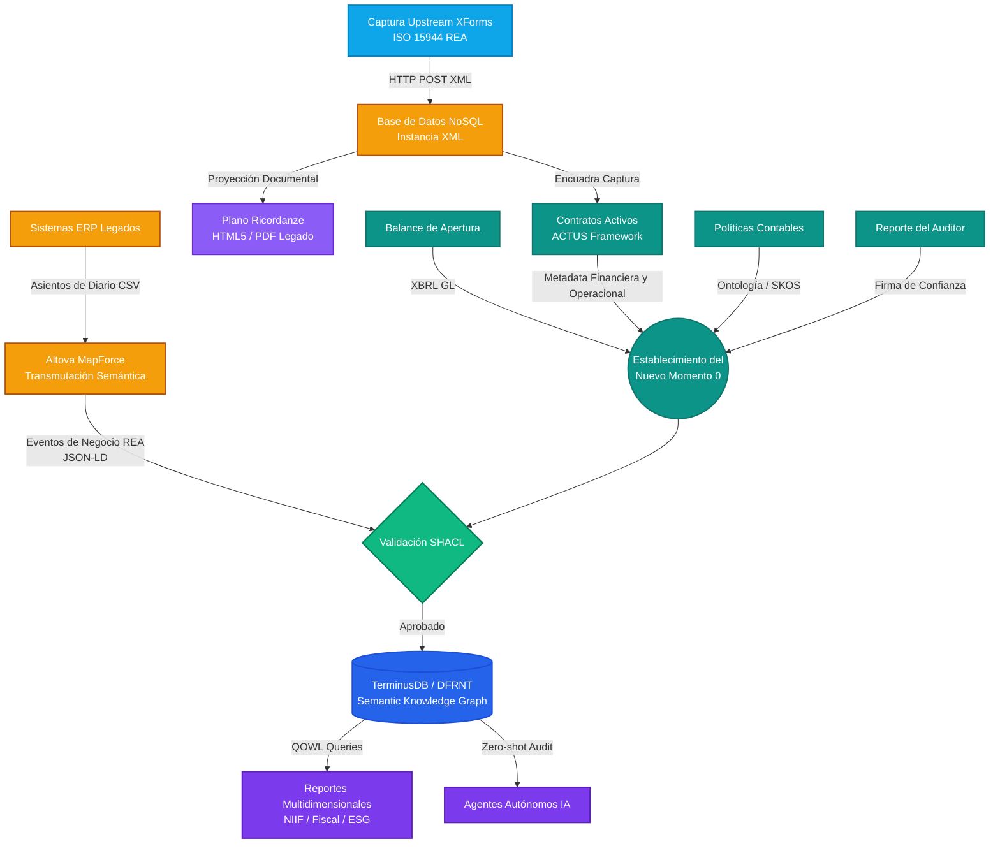

# A&AD Going Concern Onboarding Canvas — Versión 1.3

*Metodología de Implementación para Entidades en Marcha (SMEs & Firmas Tier 2)*  
*Con Captura Upstream (Shift Left ISO 15944), Base de Datos NoSQL y Proyección Dual al Plano Ricordanze*

---

## 1. El Nuevo "Momento 0" (Génesis Operacional)
Para una entidad en marcha, el universo semántico comienza con una foto inmutable de su estado actual, no con su escritura de constitución original.

*   **Balance de Apertura (Opening Balance Sheet):** El saldo inicial estructurado (XBRL GL). Este es el *holón* fundacional del nuevo Gemelo Digital. Todos los eventos futuros se calculan matemáticamente a partir de este punto.

---

## 2. Contexto Semántico y Legal + Shift Left (ISO 15944 & ACTUS)
Un saldo en el balance no significa nada sin los derechos, obligaciones y reglas que lo sustentan.

*   **Contratos Activos (ACTUS Framework):** Digitalización y extracción de todos los contratos vigentes (financieros con ACTUS y operacionales encuadrados en ISO 15944-4 / REA).
    *   **Captura Upstream (Shift Left XForms):** Formularios **XForms** (compilados vía Altova StyleVision) permiten la captura limpia de intenciones y transacciones en la fuente encuadradas en ISO 15944 REA.
    *   **Base de Datos NoSQL (Instancia XML):** Los formularios envían la instancia XML vía HTTP POST a la **Base de Datos NoSQL**, que encuadra y alimenta la caja de *Contratos Activos*.
    *   **Proyección al Plano Ricordanze:** Desde la Base de Datos NoSQL se proyectan vistas **HTML5 / PDF** hacia el *Semantic Ricordanze Plane* para conservación inmutable exigida por el sistema legado.
*   **Políticas Contables:** Las reglas de juego (US GAAP, IFRS, políticas internas) codificadas como restricciones formales en la ontología para gobernar el comportamiento del grafo.

---

## 3. Anclaje de Confianza (Assurance Anchor)
El "Shift-Left" requiere que la información que entra al sistema ya esté validada.

*   **Reporte del Auditor (Auditor's Report):** El dictamen del auditor independiente sobre el Balance de Apertura. Este documento firma criptográficamente la validez del Momento 0, estableciendo la confianza base sin necesidad de revisar la historia anterior al ERP legado.

---

## 4. Hidratación Histórica (El Puente)
Una vez establecido y validado el Momento 0, se debe conectar con el presente.

*   **Asientos Contables del Sistema Legado (Legacy Journal Entries):** Extracción de los asientos de diario desde la fecha de apertura hasta el día actual. Estos se transmutan mediante Altova MapForce de su formato tabular (CSV/SQL) a **JSON-LD (Eventos REA)**.
*   *Nota técnica:* Esta ingesta masiva se somete a validación **SHACL** instantánea al entrar al grafo.

---

## 5. El Estado Destino (El Grafo Operativo)
El resultado final de la implementación.

*   **TerminusDB / DFRNT Instanciado:** La base de datos de grafo inmutable, hidratada con el Momento 0, el contexto legal, y la historia reciente.
*   **Capacidad QOWL:** La información financiera ahora puede ser consultada multidimensionalmente usando GraphQL sobre OWL, permitiendo reportes simultáneos (NIIF, Fiscal, ESG) y auditorías por agentes de IA (**Zero-shot Audit**).

---

### Diagrama de Flujo de Implementación (Pipeline v1.3)

